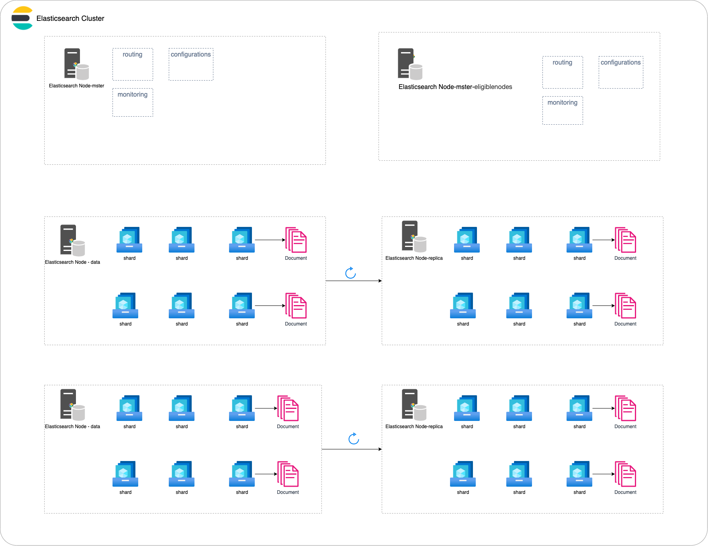

# Elasticsearch 入门实践 - 概念梳理

本章我们将梳理基本的Elasticsearch概念已经专有名词，包括集群相关的概念，数据组织结构相关的术语以及特殊的数据类型等，通过对这些内容的大致理解，可以让你在接下来的章节中提到相关术语时不再无所适从。

## 集群相关概念

### 集群cluster

  Elasticsearch以集群为单位向外提供服务，集群由一个或者多个节点组织在一起



### 节点node

一个节点是集群中的一个服务器,由一个名字来标识,默认是一个随机的漫画角色的名字(本质上是一个java进程)在生产环境中建议只在一台主机上运行一个节点

- **Master-eligiblenodes和Master Node:**

  - 每个节点启动后,默认就是一个Master eligible节点 可以设置 node.master: false禁止
  - Master-eligible节点可以参加选主流程,成为master节点
  - 当第一个节点启动时,它将自己选举成master节点
  - 每个节点上都保存了集群的状态,只有master节点才能修改集群的状态信息
  - 集群状态(Cluster state)维护了一个集群中的必要信息
    - 所有节点的信息
    - 所有的索引和其相关的Mapping与Setting信息
    - 分片路由的信息
  - 任意节点都能修改信息会导致数据一致性问题

- **Data node & Coordinating node**

  - data node: 保存数据的节点,负责保存分片数据,在数据扩展上起到了至关重要的作用
  - coordinating负责接受Client的请求,将请求分发到合适的节点,最终把结果汇集到一起,每个节点默认个都起到了Coordinating node的职责

- 配置节点类型

  - 开发环境中一个节点可以承担多种角色
  - 生产环境中,应该设置单一的角色节点(dedicated node)

  | 节点类型          | 配置参数    | 默认值                                                   |
  | ----------------- | ----------- | -------------------------------------------------------- |
  | master eligible   | node.master | true                                                     |
  | data              | node.data   | true                                                     |
  | ingest            | node.ingest | true                                                     |
  | coordinating only | 无          | 每个默认节点都是coordinating节点,设置其他类型全部为false |
  | machine learning  | node.ml     | true, (需要 enable xpack)                                |

1. **分片shard:**  将索引划分为多份的能力,允许水平分割和扩展容量,多个分片响应请求,提高性能和吞吐量

   - 主分片(Primary Shard): 用以解决数据水平扩展问题,可以将数据分布到集群内的所有节点之上
   - 主分片在索引创建时指定,后溪不允许修改,除非Reindex
   - 副本(Replica Shard): 用以解决数据的高可用问题 分片是主分片的拷贝
   - 副本分片数可以动态调整
   - 增加副本数,还可以在一定程度上提高服务的可用性(读取的吞吐)

2. **副本replica:**  创建分片的一份或多份的能力, 在一个节点失败时副本可以替换

>  A good rule of thumb is to keep shard size between 10–50 GB.
>

## 数据组织相关概念

Elasticsearch作为一个NoSQL数据库，同样使用了宽松数据类型的策略，我们接下来将列举一些Elasticsearch中常用到的术语

### 索引（index）

Elasticsearch 将数据组织成*索引*。每个索引都是 JSON 文档的集合，你可以把索引看成是关系型数据库的表。Elasticsearch可以将索引存放在一台机器或者分散在多台服务器上，每一个索引有一个或多个分片（shard），每个分片可以有多个副本（replica）。

- 索引体现了逻辑空间的概念: 每个索引都有自己的mapping定义,用于定义包含的文档的字段名和字段类型
- 分片体现了物理空间的概念: 索引中的数据分散在分片上
- 映射（Mapping）定义了索引字段的类型，可以理解成关系型数据库中创建table时对table中存储数据类型的定义，但在Elasticsearch中Mapping时optional的，Elasticsearch也可以自动为插入的数据找到一个理论合适的类型

### 映射（Mapping）

**映射(Mapping)** 创建索引时, 预先定义字段的类型以及相关属性

在没有指定Mapping时，Elasticsearch根据JSON源数据的基础类型猜测目标字段映射（动态映射）, 将输入的数据转变成可搜索的索引项,我们也可以自定义 **Mapping**定义Elasticsearch如何索引数据以及是否可以被搜索（静态映射），让索引的建立更具细致和完善。

**常见的映射字段类型：**

- string类型:text,keyword(string类型在es5开始已经废弃)
- 数字类型: long,integer, short, byte, double, float
- 日期类型: date
- bool类型: boolean
- binary类型: binary(不会被检索)
- 复杂类型: object, nested
- geo类型: geo-point,geo-shape
- 专业类型: ip, competion

### 文档（document）

Elasticsearch是面向文档的,文档是所有可搜索数据的最小单位，可以理解关系型成数据库表中的一条记录，在Elasticsearch文档中，相同字段必须有相同的类型，作为一个NoSQL数据库，文档不需要有固定的结构，每个文档可以有不同的字段。

- 文档会被序列化成JSON格式,保存在elasticsearch中

- 每个字段都有对应的类型(字符串/数值/布尔/日期/二进制/范围类型)
- 每个文档都有一个unique id，可以自己指定id，也可以通过elasticsearch自动生成

### 元数据（meta data）

元数据是Elasticsearch中给索引、文档或字段的附加信息，可以于描述、配置和管理这些数据的行为或属性。元数据不直接参与文档的存储或搜索，而是为Elasticsearch提供相关上下文。元数据可以加在索引、文档和字段上。

如下面就是一个索引级元数据

```
PUT /users
{
  "mappings": {
    "_meta": {
      "author": "Eson",
      "purpose": "store user infomation",
      "last_updated": "2024-09-11"
    },
    "properties": {
      "username": {
        "type": "text"
      },
      "brith": {
        "type": "date"
      }
    }
  }
}
```
