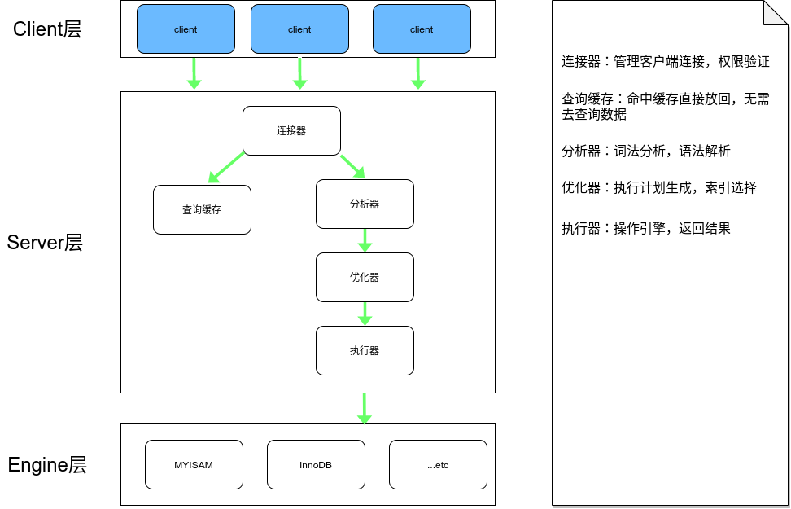
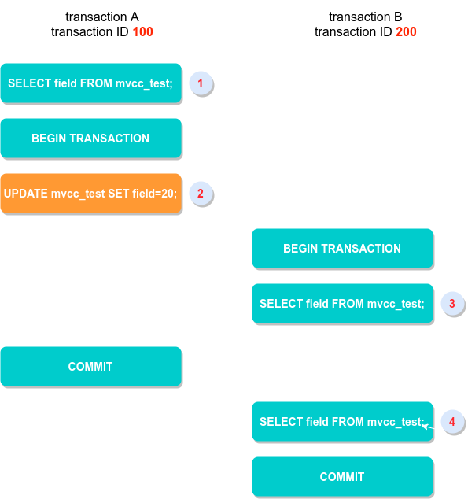
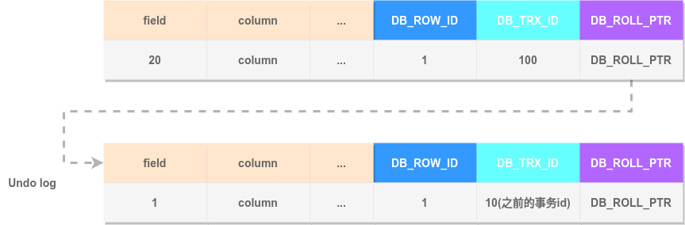
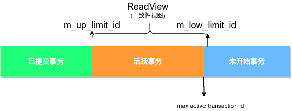
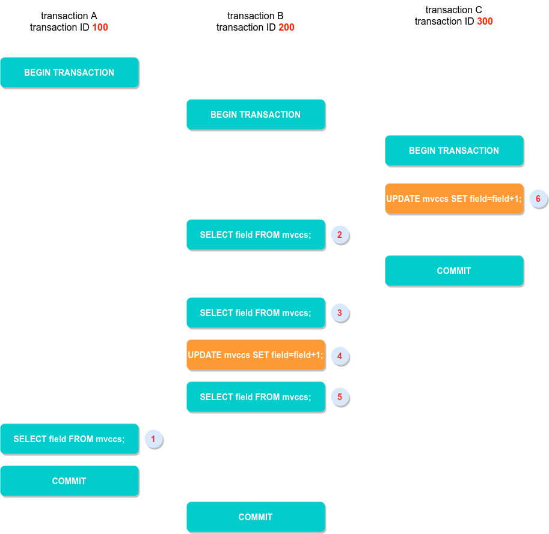

# MySQL InnoDB MVCC机制吐血总结

谈到MySQL事务，必然离不开InnoDB和MVCC机制，同时，MVCC也是数据库面试中的杀手问题，写这篇总结的目的，就是为了让自己加深映像，这样面试就不会忘记了。在搜索时发现关于MVCC的文章真的是参差不齐(老子真的是零零散散看了三个月都迷迷糊糊)，所以这里集合了各家所言之后进行了自我总结，苦苦研究了许久，才得到的比较清晰的认知，这可能也是我目前最有深度的一篇博客了把，希望对我和看到的人都有所帮助，哈哈。

MVCC: Multiversion Concurrency Control,翻译为多版本并发控制，其目标就是为了提高数据库在高并发场景下的性能。

**MVCC最大的优势：读不加锁，读写不冲突。在读多写少的场景下极大的增加了系统的并发性能**

在讲解MVCC之前我们需要先了解MySQL的基本架构，如下图所示：



<center>图一</center>
## MySQL事务

MySQL的事务是在存储引擎层实现的，在MySQL中，我们最常用的就是InnoDB和MyISAM，我们都知道，MYISAM并不支持事务，所以InnoDB实现了MVCC的事务并发处理机制，也是我们这篇文章的主要研究内容。

可能我们都看到过，MVCC只在RC和RR下，为了分析这个问题，我们先回顾一下SQL标准事务隔离级别<font color="red">`` 隔离性``</font>

- `read uncommitted` 读未提交： 一个事务还没提交时，它做的变更就能被别的事务看到。
- `read committed` 读提交：一个事务提交之后，它做的变更才会被其他事务看到。
- `repeatable read` 可重复读：一个事务执行过程中看到的数据，总是跟这个事务在启动时看到的数据是一致的。在可重复读隔离级别下，未提交变更对其他事务也是不可见的。
- `serializable` 串行化 ：对于同一行记录，“写”会加“写锁”，“读”会加“读锁”。

我们通过两个事务提交流程来说明事务隔离级别的具体效果:

我们假设有一个表，仅有一个字段field:

```sql
DROP TABLE IF EXISTS `mvcc_test`;
CREATE TABLE `mvcc_test`( `field` INT)ENGINE=InnoDB;
INSERT INTO `mvcc_test` VALUES(1); -- 插入一条数据
```

如下的操作流程：



<center>图二</center>
根据事务隔离级别的定义，我们可以来推测，事务A提交前后，事务B的两次读取`3`和`4`分别读取的值：

1. 若事务B的隔离级别为 `read uncommitted`，事务B的两次读取都读取到了20，即修改后的值
2. 若事务B的隔离级别是`read committed`，那么，事务B的操作`3`读取到的值为1，而`4`读取到的值为20，因为`4`时事务A已经完成了提交
3. 若事务B的隔离级别是`repeatable read`或`serializable`，那么操作`3`和`4`读取的值都是1。

## MVCC的必要性

MySQL中MYISAM并不支持事务，同样的， MVCC也就和他没有半毛钱关系了，InnoDB相比与MYISAM的提升就是对于行级锁的支持和对事务的支持，<font color="red">而应对高并发事务, `MVCC` 比单纯的加行锁更有效, 开销更小</font>。

但是单纯的并发也会带来十分严重的问题：

1. `Lost Update`更新丢失: 多个事务对同一行数据进行读取初值更新时，由于每个事务对其他事务都未感知，会造成最后的更新覆盖了其他事务所做的更新。
2. `dirty read`脏读: 事务一个正在对一条记录进行修改，在完成并提交前事务二也来读取该条记录，事务二读取了事务一修改但未提交的数据，如果事务一回滚，那么事务二读取到的数据就成了“脏”数据。
3. `non-repeatable read`不可重复读: 个事务在读取某些数据后的某个时间再次读取之前读取过的数据，发现读出的数据已经发生了改变或者删除，这种现象称为“不可重复读”
4. `phantom read`幻读: 个事务按相同的查询条件重新读取以前检索过的数据，发现其他事务插入了满足查询条件的新数据，这种现象称为“幻读”

不可重复读与幻读的现象是比较接近的，也有人直接就说幻读就是不可重复读，我比较倾向与他两就是他两个： 不可重复读针对的是值的不同，幻读指的是数据条数的不同。同样的对于幻读，单纯的MVCC机制并不能解决幻读问题，InnoDB也是通过加间隙锁来防止幻读。

从本质上来说，事务隔离级别就是系统并发能力和数据安全性间的妥协，我们在刚开始学习数据库时就在说: 隔离性越高，数据库的性能就越差，就是这个结果，只是我们当时只知其然罢了。

解决并发带来的问题，最通常的就是加锁，但锁对于性能也是腰斩性的，所以MVCC就显得十分重要了。

抄大佬的一句话： 在不同的隔离级别下，数据库通过 `MVCC` 和隔离级别，让事务之间并行操作遵循了某种规则，来保证单个事务内前后数据的一致性。

## InnoDB 下的 MVCC 实现原理

在InnoDB中MVCC的实现通过两个重要的字段进行连接：`DB_TRX_ID`和`DB_ROLL_PT`，在多个事务并行操作某行数据的情况下，不同事务对该行数据的` UPDATE `会产生多个版本，数据库通过`DB_TRX_ID`来标记版本，然后用`DB_ROLL_PT`回滚指针将这些版本以先后顺序连接成一条 `Undo Log` 链。

对于一个没有指定`PRIMARY KEY`的表，每一条记录的组织大致如下：


1. `DB_TRX_ID`: 事务id，6byte，每处理一个事务，值自动加一。

   > InnoDB中每个事务有一个唯一的事务ID叫做 transaction id。在事务开始时向InnoDB事务系统申请得到，是按申请顺序严格递增的
   >
   > 每行数据是有多个版本的，每次事务更新数据时都会生成一个新的数据版本，并且把transaction id赋值给这个数据行的DB_TRX_ID

2. `DB_ROLL_PT`: 回滚指针，7byte，指向当前记录的`ROLLBACK SEGMENT` 的undolog记录，通过这个指针获得之前版本的数据。该行记录上所有旧版本在 `undolog` 中都通过链表的形式组织。

3. 还有一个`DB_ROW_ID(隐含id,6byte，由innodb自动产生)`，我们可能听说过InnoDB下聚簇索引B+Tree的构造规则: 

   >如果声明了主键，InnoDB以用户指定的主键构建B+Tree，如果未声明主键，InnoDB 会自动生成一个隐藏主键，说的就是`DB_ROW_ID`。另外，每条记录的头信息（record header）里都有一个专门的`bit`（deleted_flag）来表示当前记录是否已经被删除

我们通过图二的UPDATE(即操作2)来举例Undo log链的构建(假设第一行数据DB_ROW_ID=1)：

1. 事务A对DB_ROW_ID=1这一行加排它锁
2. 将修改行原本的值拷贝到Undo log中
3. 修改目标值，产生一个新版本，将`DB_TRX_ID`设为当前事务ID即100，将`DB_ROLL_PT`指向拷贝到Undo log中的旧版本记录
4. 记录redo log， binlog

最终生成的Undo log链如下图所示:



相比与UPDATE，INSERT和DELETE都比较简单: 

- INSERT: 产生一条新的记录，该记录的`DB_TRX_ID`为当前事务ID
- DELETE: 特殊的UPDATE，在`DB_TRX_ID`上记录下当前事务的ID，同时将`delete_flag`设为true，在执行commit时才进行删除操作

MVCC的规则大概就是以上所述，那么它是如何实现高并发下`RC`和`RR`的隔离性呢，这就是在MVCC机制下基于生成的Undo log链和<font color="red">一致性视图ReadView</font>来实现的。

## 一致性视图的生成 ReadView

要实现`read committed `在另一个事务提交之后其他事务可见和`repeatable read`在一个事务中SELECT操作一致，就是依靠ReadView，对于`read uncommitted`，直接读取最新值即可，而`serializable`采用加锁的策略通过牺牲并发能力而保证数据安全，因此只有`RC`和`RR`这两个级别需要在MVCC机制下通过ReadView来实现。

**在read committed级别下，readview会在事务中的每一个SELECT语句查询发送前生成**（也可以在声明事务时显式声明`START TRANSACTION WITH CONSISTENT SNAPSHOT`），因此每次SELECT都可以获取到当前已提交事务和自己修改的最新版本。而在`repeatable read`级别下，每个事务只会在第一个SELECT语句查询发送前或显式声明处生成，其他查询操作都会基于这个ReadView，这样就保证了一个事务中的多次查询结果都是相同的，因为他们都是基于同一个ReadView下进行MVCC机制的查询操作。

 InnoDB为每一个事务构造了一个数组`m_ids`用于保存一致性视图生成瞬间当前所有`活跃事务`(开始但未提交事务)的ID，将数组中事务ID最小值记为低水位`m_up_limit_id`，当前系统中已创建事务ID最大值+1记为高水位`m_low_limit_id`，构成如图所示:



一致性视图下查询操作的流程如下:

1. 当查询发生时根据以上条件生成ReadView，该查询操作遍历Undo log链，根据当前被访问版本(可以理解为Undo log链中每一个记录即一个版本，遍历都是从最新版本向老版本遍历)的`DB_TRX_ID`，如果`DB_TRX_ID`小于`m_up_limit_id`,则该版本在ReadView生成前就已经完成提交，该版本可以被当前事务访问。<font color="1FFF78">**`DB_TRX_ID`在绿色范围内的可以被访问**</font>
2. 若被访问版本的`DB_TRX_ID`大于`m_up_limit_id`，说明该版本在ReadView生成之后才生成，因此该版本不能被访问，根据当前版本指向上一版本的指针`DB_ROLL_PT`访问上一个版本，继续判断。<font color="6BBAFF">**`DB_TRX_ID`在蓝色范围内的都不允许被访问**</font>
3. 若被访问版本的`DB_TRX_ID`在[m_up_limit_id, m_low_limit_id)区间内，则判断`DB_TRX_ID`是否等于当前事务ID，等于则证明是当前事务做的修改，可以被访问，否则不可被访问, 继续向上寻找。<font color="FF9933">**只有`DB_TRX_ID`等于当前事务ID才允许访问橙色范围内的版本**</font>
4. 最后，还要确保满足以上要求的可访问版本的数据的`delete_flag`不为true，否则查询到的就会是删除的数据。

所以以上总结就是**<font color="red">只有当前事务修改的未commit版本和所有已提交事务版本允许被访问</font>**。我想现在看文章的你应该是明白了(主要是说我自己)。

## 一致性读和当前读

前面说的都是查询相关，那么涉及到多个事务的查询同时还有更新操作时，MVCC机制如何保证在实现事务隔离级别的同时进行正确的数据更新操作，保证事务的正确性呢，我们可以看一个案例:

```sql
DROP TABLE IF EXISTS `mvccs`;
CREATE TABLE `mvccs`( `field` INT)ENGINE=InnoDB;
INSERT INTO `mvccs` VALUES(1); -- 插入一条数据
```

假设在所有事务开始前当前有一个活跃事务10，且这三个事务期间没有其他并发事务: 

1. 在操作1开始SELECT语句时，需要创建一致性视图，此时当前事务的一致性视图为[10, 100, 200，301), 事务100开始查询Undo log链，第一个查询到的版本为为事务200的操作4的更新操作， `DB_TRX_ID`在`m_ids`数组但并不等于当前事务ID， 不可被访问；

2. 向上查询下一个即事务300在操作6时生成的版本，小于高水位`m_up_limit_id`，且不在`m_ids`中，处于已提交状态，因此可被访问；
3. 综上在`RR`和`RC`下得到操作1查询的结果都是2

那么操作5查询到的field的值是多少呢？

在`RR`下，我们可以明确操作2和操作3查询field的值都是1，在`RC`下操作2为1，操作3的值为2，那么操作5的值呢？

答案在`RR`和`RC`下都是是3，我一开始以为`RR`下是2，因为这里如果按照一致性读的规则，事务300在操作2时都未提交，对于事务200来说应该时不可见状态，你看我说的是不是好像很有道理的样子？

上面的问题在于UPDATE操作都是读取<font color="red">**当前读(current read)**</font>数据进行更新的，而不是一致性视图ReadView，因为如果读取的是ReadView，那么事务300的操作会丢失。当前读会读取记录中的最新数据，从而解决以上情形下的并发更新丢失问题。

## 参考资料

《高性能 MySQL》

[MySQL InnoDB MVCC 机制的原理及实现](https://chenjiayang.me/2019/06/22/mysql-innodb-mvcc)

[MySQL实战45讲](https://time.geekbang.org/column/intro/139)

## 尾巴

说是为了应付面试，可是简历都已经石沉大海，回首整个春招，真的只有三次可怜的面试机会，面试我的连MySQL事务都不问的，emm...现在春招已过，已经来临的秋招已经完美忽略了我这个2020的渣渣毕业生，虽然少，也有收获与感动，前路坎坷，仍要欣然前往。可能自己是真的比较笨了，一个MVCC前前后后断断续续搞了3个月才差不多搞懂，这一年各方面都实在太难，但一直告诉自己，不能一直在表面停留，满足与CURD，必须有所深入，虽则如云，匪我思存。加油！