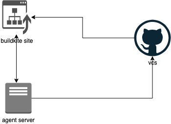

# buildkite 入门

buildkite是一个商业自持续集成/部署工具，市场上有很多类似的工具如开源的，[Jenkins](https://www.jenkins.io/),[GoCD](https://www.gocd.org/), [concourse](https://github.com/concourse/concourse)等，还有商业化的[Travis CI](https://blog.takipi.com/jenkins-vs-travis-ci-vs-circle-ci-vs-teamcity-vs-codeship-vs-gitlab-ci-vs-bamboo/#2)，[buildkite](https://buildkite.com/)，[Bamboo](https://www.atlassian.com/software/bamboo)等 相比与开源的构建工具需要自己去部署server，agent等一系类部署配置，商业化的CI/CD工具可以直接使用厂商服务器直接构建，更加开箱即用，今天就来聊聊这两天疯狂折磨我的buildkite。

## buildkite 基本架构

buildkite主要为展示状态的website，执行任务的agent以及第三方的repository构成：



开发人员在site上配置agent，构建pipeline同时将pipeline和repo进行关联，在repo的代码发生改变时，由vcs触发buildkite的构建，也可以手动在site中进行触发，还可以在一条pipeline中触发另一条pipeline的build。pipeline的构建步骤都会交给agent去处理，agent处理完成后将结果反馈给site服务。

## buildkite 基本概念

1. **agent**

   buildkite执行定任务的终端，与[Travis CI](https://blog.takipi.com/jenkins-vs-travis-ci-vs-circle-ci-vs-teamcity-vs-codeship-vs-gitlab-ci-vs-bamboo/#2)不同，buildkite不提供执行任务的instance，且承诺：

   > Buildkite never accesses your code

   最大程度的确保企业对代码的可控性，降低代码泄漏风险。虽然相比[Travis CI](https://blog.takipi.com/jenkins-vs-travis-ci-vs-circle-ci-vs-teamcity-vs-codeship-vs-gitlab-ci-vs-bamboo/#2)需要额外添加服务器，但好在buildkite部署agent也十分简单。

2. **pipeline**

   一个pipeline用于包含一个可运行或发布的服务/依赖，如在一个微服务下的一个服务，一个通用的依赖包，一般和一个项目的repo相对应。我们在一条pipeline中定义他的处理流程，通过在yml中定义不同的steps，用以对该该服务/依赖进行诸如lint，test，package，publish和deploy等操作。

3. **build**

   pipeline定义了CI/CD的流程，而每一个build则是不同版本的代码执行这个流程的记录，因此随着时间的推移，构建次数的增加，一个pipeline下的build就会越来越多，我们可以在dashboard中手动出发新的build也可以通过配置repository的hook在代码发生变化如push， pull request等event时自动trigger我们新的build。

4. **steps**

   我们在一个yml文件中定义了一个pipeline，而这个pipeline的构建流程的基本单位便是这个yml中的step，我们可以在一个pipeline中定义多个step，甚至可以动态构建steps。每一个step都可以运行在不同的agent中，同时，注册的每一个agent。 

5. **hooks**

   buildkite允许在build生命周期中加入hook进行额外的处理，如我们可以使用hook将上一个step的artifacts中的内容export到当前构建的environment中等。
   hook是在build的生命周期上下文中被调用的，所以buildkite以生命周期命名hook，所以hook的脚本名称是定义好的，不能自定义。

   buildkite提供了3种不同的hook：

   1. **Agent hooks**：存储在特定agent目录下(如ubuntu下`/etc/buildkite-agent/hooks/`)，也可以通过在启动agent时使用`--hooks-path ~/.buildkite-agent/hooks`显式指定存储hook的目录。只有在该agent下执行的step才会触发这些hook。
   2. **Repository hooks**：存储在repo的`.buildkite/hooks`目录下，作用于该repo的pipeline的每一次build。
   3. **Plugin hooks**：plugin的本质其实也就是一个hook的集合，以上两种hook在一次build中的每一个step生命周期中都会执行，但Plugin hook只在使用了该Plugin的step下才会被触发。

6. **Plugins**

   > A plugin is a Git repository that overrides or extends a [command step](https://buildkite.com/docs/pipelines/command-step)’s behaviour using one or more [hooks](https://buildkite.com/docs/agent/v3/hooks).

   上面是官方解释，个人理解就是将hook的集合放到一个单独的repo中，在需要的step中进行引用，可以很好的实现hook的复用。buildkite官方也维护了很多的plugin实现相对复杂且共用性较强的流程。

7. **Queues**

   用来分组agents，我们可以让特定的step在特定的agents中执行，或者让程序可以区分不同环境的agents进行构建或部署。在启动agents时用`--tags`或者在配置文件以及使用`BUILDKITE_AGENT_TAGS`都可以给一个agents加上queue的标识。默认会放入到default的group中，pipeline的模版在未指定agents时也是默认使用default下的agent执行任务。

   ## build生命周期和可用hook

   生命周期贯穿pipeline的每一次build，而且与hook密不可分，官方并没有强调生命周期的流程，但我们可以通过可永久的hook和执行顺序得到pipeline在执行时每一个step经历的步骤： 

   | Hook            | Order                     | Description                                                  |
   | :-------------- | :------------------------ | :----------------------------------------------------------- |
   | `environment`   | Agent, Plugin             | Runs before all other hooks.                                 |
   | `pre-checkout`  | Agent, Plugin             | Runs before checkout.                                        |
   | `checkout`      | Plugin, Agent             | Overrides the default `git checkout` behavior.               |
   | `post-checkout` | Agent, Repository, Plugin | Runs after checkout.                                         |
   | `pre-command`   | Agent, Repository, Plugin | Runs before the build command.                               |
   | `command`       | Plugin, Repository, Agent | Overrides the default command running behavior.              |
   | `post-command`  | Agent, Repository, Plugin | Runs after the command.                                      |
   | `pre-artifact`  | Agent, Repository, Plugin | Runs before artifacts are uploaded, if an artifact upload pattern was defined for the job. |
   | `post-artifact` | Agent, Repository, Plugin | Runs after artifacts have been uploaded, if an artifact upload pattern was defined for the job. |
   | `pre-exit`      | Agent, Repository, Plugin | Runs before the job finishes. Useful for performing cleanup tasks. |

   

   ## 运行状态与结果

   CI/CD工具的每一个构建过程有时可以是stateless的，但有时却不可以。有的build需要依赖上一次构建的结果如成功与否，上一个step的产出如打包好的package或可执行的二进制程序等。但同一个build的step并不一定在同一个agent下执行，因此就需要一定的机制可以对执行状态和结果进行step间的共享。

   我们可用通过一下三种方式进行状态的管理：

   1. **Enviroment Variables**

      运行的环境变量，可以在定义pipeline的yaml，所有的hook script以及plugin中使用，贯穿整个build生命周期。buildkite自身定义了很多`Enviroment Variables`如`BUILDKITE_BRANCH`当前构建的分支名，`BUILDKITE_AGENT_PID`执行该step的agent的PID等，有些值允许在特定的生命周期中被改变，有的则只读，具体可以在使用过程中参照官方文档。

      同时，我们在执行新build时可以手动或在通过一条pipeline trigger另一条时注入我们自定义的`Enviroment Variables`。

   2. **artifacts**

      执行完成一个step后将一些产出通过artifacts的机制进行输出，如应用的打包，测试报告等。

      ```bash
      # upload a file
      buildkite-agent artifact upload file_path
      # download a file
      buildkite-agent artifact download source destination
      ```

   3. **Meta-data**

      可以用来在step之间传递非敏感的简单内容。由于step之间并不一定在同一个agent中执行，如何将上一个step的一些状态带到下一个step中就变成了一个问题，对于比较大的内容诸如打包好的可执行文件我们可以用`artifacts`来解决，对于一些简单的k-v值，我们就可以使用`meta-data`来存储。

      ```bash
      # set meta-data
      buildkite-agent meta-data set "release-version" "1.1"
      # get meta-data
      buildkite-agent meta-data set "release-version" "1.1" # get "1.1"
      ```

   

## 构建案例

前面讲完概念性的内容，先来看两个官方的案例：

Example :

```yaml
steps:
  - label: ":hammer: Tests"
    command: scripts/tests.sh
    env:
      BUILDKITE_DOCKER_COMPOSE_CONTAINER: app

  - wait

  - label: ":package: Package"
    command: scripts/build-binaries.sh
    artifact_paths: "pkg/*"
    env:
      BUILDKITE_DOCKER_COMPOSE_CONTAINER: app

  - wait

  - label: ":debian: Publish"
    command: scripts/build-debian-packages.sh
    artifact_paths: "deb/**/*"
    branches: "master"
    agents:
      queue: "deploy"

  - block: ":shipit: Release"
    branches: "master"

  - label: ":github: Release"
    command: scripts/build-github-release.sh
    artifact_paths: "releases/**/*"
    branches: "master"

  - wait

  - label: ":whale: Update images"
    command: scripts/release-docker.sh
    branches: "master"
    agents:
      queue: "deploy"
```

以上案例中steps共有9个item，每一个item中都会有一些配置项，buildkite目前有5中不同的step可以使用：

1. Command Step

   如上面的step1就是一个command step，包含了command项。command可以是一个普通的命令，也可以是一个执行脚本。最基本结构如下:

   ```yaml
   steps:
     - command: "tests.sh"
   ```

   command也可以是一个可执行命令&脚本的list集合。我们还可以为step添加条件执行，自动重试，禁止重试以及软失败等诸多特性，如果需要可以参照官方文档进行使用，这里不做过多介绍。

   多个command step在可有用agent是可以进行并行执行，默认也是并行执行的，可以大大提高执行效率。但有时步骤间有依赖关系就需要依赖步骤间进行顺序执行，这就需要wait step的帮助。

2. Wait Step

   顾名思义，wait step就是用来进行顺序执行的，再wait之前的step会先于wait之后的step执行，只有wait之前的step执行完成后才会进行step之后的步骤进行操作。

   在有些场景如我们打包发布一个 java的package，那么在package和publish之间就必须顺序进行，就可以使用wait step进行控制

   ```yaml
   - command: "package_java_jar.sh"
   - wait：～
   - command: "publish_java_jar.sh"
   ```

   结尾的～表示wait后面没有任何子属性配置，下一项将是新的step。官方推荐添加，一作区分。

3. Block Step

   以上的step都会自动执行直到失败或者全部执行完毕，有时我们并不希望所有的step都自动执行完成，如部署的step可以进行人为触发，而block step便是用来终止自动向下执行的step，通过block step可以将执行停止在某一个任务之前，进行人为触发，同时还支持input相关的属性进行配置，可以详细参考文档。

   ```yaml
   steps:
     - block: ":rocket: Release!"
   ```

4. Input Step

   Input step即进行用户内容输入的step，pipeline会根据yaml的配置弹出input框，再pipeline中通过meta-data进行输入内容的读取，只是要注意input step并不会block后续的step，如果需要构建一定的顺序，可以使用再block下加input相关属性或者使用wait step。

   ```yaml
   steps:
     - input: "Information please"
       fields:
         - text: "What is the date today?"
           key: "todays-date"
   ```

   Input 提供了输入框，单选，多选三种方式。

5. Trigger Step

   用以在一条pipeline上出发另一条pipeline的build。同时我们可以使用buid和env属性从当前build将一些必要的内容传递到目标build中。

   ```yaml
   - trigger: "app-sub-pipeline"
     label: "Sub-pipeline"
     build:
       message: "${BUILDKITE_MESSAGE}"
       commit: "${BUILDKITE_COMMIT}"
       branch: "${BUILDKITE_BRANCH}"
       env:
         BUILDKITE_PULL_REQUEST: "${BUILDKITE_PULL_REQUEST}"
         BUILDKITE_PULL_REQUEST_BASE_BRANCH: "${BUILDKITE_PULL_REQUEST_BASE_BRANCH}"
         BUILDKITE_PULL_REQUEST_REPO: "${BUILDKITE_PULL_REQUEST_REPO}"
   ```

除此之外，buildkite还可以与slack进行关联，通知构建状态，容器化构建，docker-compose构建，使用[Elastic CI Stack for AW](https://github.com/buildkite/elastic-ci-stack-for-aws)将aws 作为我们的agent进行构建，甚至提供了对外的api，可以集成到系统的管理端进行pipeline的创建，执行等操作。目前还限于使用基本的功能，等使用到在进行一一介绍吧。

