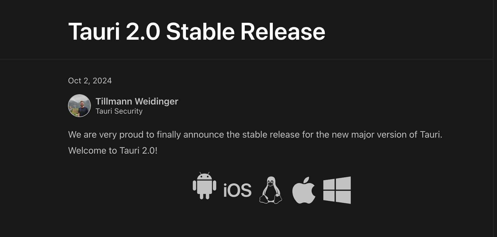
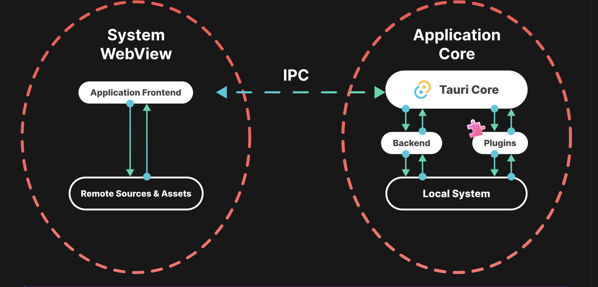
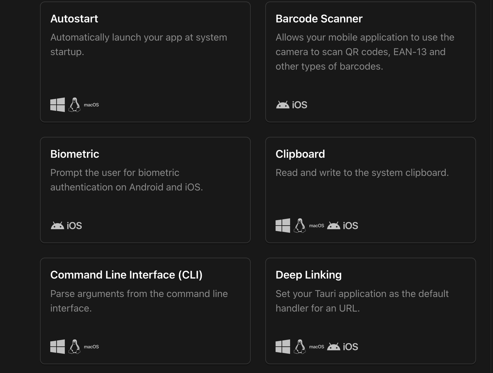

# tauri2.0都来了，你却还在学electron？

如果你不知道tauri，它是一个跨平台桌面软件开发工具，允许前端开发者使用他们已经十分熟悉的前端开发框架和工具链开发桌面应用软件，大大降低了桌面软件的开发门槛，同时相较于传统的桌面软件开发如GTK，WPF以及QT，基于html，css和js的前端ui开发工具链在开发效率上有先天优势。类似的开发平台还有electron，作为老牌的跨平台解决方案，大量人们熟知的应用如vscode，slack等都是基于electron，但所谓兵无常势，水无常形，如果你在寻找跨平台软件开发方案，tauri将是一个非常值得考虑方案，包括极客范的跨平台NoSQL数据库客户端[DocKit](https://dockit.geekfun.club/)也是基于tauri进行构建的。下面让我们来看看tauri2.0都带来了些什么，相比于electron，它又有哪些显著的优势

## tauri2.0：真正意义的全平台跨端开发方案

随着tauri2.0正式版的发布，tauri终于构建起了愿景中的完全体的第一版，不同于electron仅支持桌面端，tauri2.0在此基础上还增加了对移动端的支持，也就是说，你可以一套代码开发出几乎适用于所有当今市面上设备的软件，这在以往通常需要桌面端electron+移动端React-Native或uniapp两套代码才能解决的问题一下子可以直接用tauri2.0就解决了。



随着如今平板，折叠手机甚至高贵的三折手机的不断涌现以及以办公效率作为这些设备的卖点，对大屏幕的适配也将是抢占占有率的一个不可失去的高地，对于小微企业以及独立开发工作室而言，tauri2.0的一套代码，全端覆盖无疑对这些企业有着巨大的吸引力。也为此，无论是想要尝试移动开发还是桌面开发，从tauri2.0下手，都是一个非常不错的选择。

## tauri2.0：极致轻量的软件构建

天下苦electron久已，我相信前端开发者们一定对这个梗不陌生，electron确实将桌面开发带入了一个新的纪元，让桌面软件开发不再高高在上，一个些网站的前端开发者就可以轻松写出桌面应用，并且得益于HTML和CSS在UI和动画方面的优势，轻松就可以构建出交互美观度都十分不错的桌面端程序，但同时，由于electron都自带了一个[Chromium](https://www.chromium.org/Home)内核，导致即使你的应用只显示了一个hello world，打包后的安装包也得有100MB+之巨，当你的电脑安装了十几个electron之后，硬盘空间便变得捉襟见肘了，更何况这都是浪费在存储一个完全一样的内核程序。同样的由于每一个electron应用在运行时都需要加载自己的electron内核，对内存的压力便直线上升，这对用户体验的影响是十分减分的。

tauri 采用了另一套策略，它不再自带Chromium转而通过调养系统的webview接口来渲染ui，而系统层则通过rust编写然后编译成系统可以直接运行的二进制可执行文件，在牺牲了对一些老系统或特殊系统的支持作为代价而大大降低了应用程序安装包的体积以及内存占用，以极客范的真实案例，我们的NoSQL数据库客户端DocKit就在0.4.0的版本中经历了从electron迁移到tauri的重构，在经过迁移后，包体积立即从200MB+缩减到了10MB+，改进不可谓不巨大，同样内存也占用也得到了很大的改进。



对于兼容性的担忧，我倒是觉得不必过于忧虑，除非你的软件产品需要安装到非常特殊的设备或者面对的是政府单位等十分老旧的系统，否则特别是C端而言，并不会有太多兼容问题，退一步说，这些用老旧设备的用户无论从数量还是成为你产品的订阅用户来说，比例都是微乎其微的（当然，这也是我目前看到的一家之言，也欢迎大家留下自己的观点）。

## tauri2.0：全面拥抱插件生态

相比于tauri V1， tauri2.0 将一些原本属于tauri核心的功能和API搬到了插件系统中，同时也鼓励开发者丰富插件生态，可以预见插件也将是tauri中面向开发者大有可为的一片未竟之地，同时插件化生态使得开发者可以像搭积木一样构建自己的应用程序，仅仅安装自己所需要的库，减少不需要的依赖，在进一步控制应用体积的同时也可以杜绝由于这些多余依赖带来的bug和潜在安全风险。



## 更多

除了上面提到的，作为以此全面的大版本升级，tauri还重写了进程间通信，更加细粒度的权限控制，安全审计等，使得在安全方面本就有天然优势的rust在tauri下与electron相比更是一骑绝尘，还有热重载等，凡此种种，都使得tauri在跨平台开发领域形成了强有力的竞争优势，tauri在github上的star也已经来到了83K+，直指114k的electron，让我们一起期待更多基于tauri的优秀软件的到了，涤荡这electron的浑浊世界，也欢迎在评论区一起交流你的开发体验！


# Painless scripting scenarios:
- [ ] _search - script_fields
     ```json
  GET my-index-000001/_search
  {
  "script_fields": {
    "my_doubled_field": {
      "script": { 
        "source": "doc['my_field'].value * params['multiplier']", 
        "params": {
          "multiplier": 2
        }
      }
    }
  }
  }
  ```
  
- [ ] _search - runtime_mappings
     ```json
     GET my-index-apache-log/_search
     {
       "runtime_mappings": {
         "clientip": {
           "type": "ip",
           "script": """
             String clientip=grok('%{COMMONAPACHELOG}').extract(doc["message"].value)?.clientip;
             if (clientip != null) emit(clientip); 
           """
         }
       },
       "query": {
         "exists": {
           "field": "clientip"
         }
       },
       "fields" : ["clientip"]
     }
     ```
     
- [ ] _mappings
     
     ```json
     PUT my-index/_mappings
     {
       "runtime": {
         "http.clientip": {
           "type": "ip",
           "script": """
             String clientip=grok('%{COMMONAPACHELOG}').extract(doc["message"].value)?.clientip;
             if (clientip != null) emit(clientip); 
           """
         }
       }
     }
     ```
     
     
     
- [ ] _update

     ```json
     POST my-index-000001/_update/2
     {
       "script": {
         "source": "ctx._source.tags.add(params['tag'])",
         "lang": "painless",
         "params": {
           "tag": "blue"
         }
       }
     }
     ```

     
