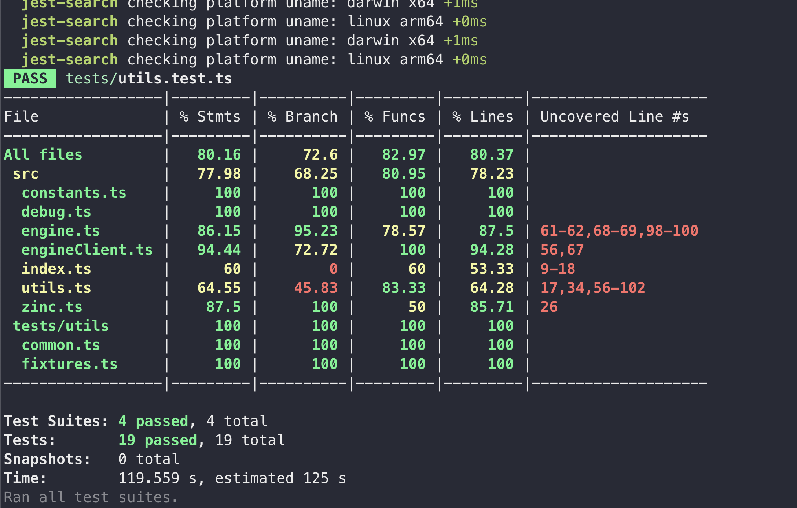

# 使用 jest-search 实现 Elasticsearch 集成测试

[jest-search GitHub](https://github.com/geek-fun/jest-search)
Elasticsearch 已经成为现代应用程序的一个重要组成部分，特别是那些需要处理大量数据并且需要高效搜索能力的应用程序。在开发使用 Elasticsearch 的应用程序时，确保应用程序与 Elasticsearch 的集成正常运作非常重要。通过集成测试是实现这一目标的一种有效方式。

## 集成测试

集成测试涉及对应用程序不同组件之间的交互进行测试，以确保它们按预期一起工作。在 Elasticsearch 的上下文中，集成测试确保您的应用程序能够正确地与 Elasticsearch 实例通信，并执行诸如索引文档、搜索和聚合等各种操作。


## 设置 Elasticsearch 集成测试

有几种实现 Elasticsearch 集成测试的方法，您可以启动一个容器来运行 Elasticsearch 服务器，或者配置一个专门用于测试目的的远程 Elasticsearch 服务器。在本文中，我将介绍另一种使用 jest-search 来实现 Elasticsearch 集成测试的方法，它会为您启动一个本地服务器。

### jest-search

[jest-search](https://github.com/geek-fun/jest-search) 是一个 jest-preset，它可以帮助您在本地启动 Elasticsearch、OpenSearch 和 ZincSearch，它会在测试开始前自动下载和启动服务器，并在测试结束后关闭服务器。

### 先决条件：

ElasticSearch 和 OpenSearch 依赖于 Java，请确保您已安装 Java 并设置了 `JAVA_HOME`。

`jest-search` 提供两种设置的方式，一种是全局设置，另一种是仅在特定测试中运行。

### 1. 安装 jest-search

要开始使用 `jest-search` 进行集成测试，首先需要安装该包。您可以使用 npm 进行安装：

```bash
npm install --save-dev @geek-fun/jest-search
```

### 2. 配置服务器

您可以在 [readme](https://github.com/geek-fun/jest-search) 中找到所有可配置的项目和详细的说明。

```javascript
module.exports = () => {
  return {
    engine: 'elasticsearch', // 或 'opensearch' 或 'zincsearch'
    version: '8.8.2',
    port: 9200,
    binaryLocation: '', // 可选
    clusterName: 'jest-search-local',
    nodeName: 'jest-search-local',
    zincAdmin: 'admin',
    zincPassword: 'Complexpass#123',
    indexes: [
      {
        name: 'index-name',
        body: {
          settings: {
            number_of_shards: '1',
            number_of_replicas: '1'
          },
          aliases: {
            'your-alias': {}
          },
          mappings: {
            dynamic: false,
            properties: {
              id: {
                type: 'keyword'
              }
            }
          }
        }
      }
    ]
  };
};
```

### 3. 创建 `jest-global-setup.js`

```javascript
const { globalSetup } = require('@geek-fun/jest-search');
module.exports = async () => {
  await Promise.all([globalSetup()]);
};
```

### 4. 创建 `jest-global-teardown.js`

```javascript
const { globalTeardown } = require('@geek-fun/jest-search');
module.exports = async () => {
  await Promise.all([globalTeardown()]);
};
```

### 5. 修改 `jest-config.js`

```javascript
module.exports = {
	...
  globalSetup: '<rootDir>/jest-global-setup.js',
  globalTeardown: '<rootDir>/jest-global-teardown.js',
};
```

### 6. 编写您的测试

```typescript
// tests/utils/helper.ts 示例工具函数用于添加测试项
export const saveBook = async (bookDoc: { name: string; author: string }) => {
  await esClient.index({ index, body: bookDoc, refresh: true });
};

// tests/book.test.ts 示例测试
beforeAll(async () => {
  await saveBook(mockBook);
});
```

### 仅运行特定测试

上述步骤将在运行 `npm run test` 时启动服务器。如果您只想在运行特定文件时启动服务器，您可以使用 `beforeAll` 和 `afterAll` 进行控制。以下是具体步骤：

步骤 1 和 2 与上述步骤相同，`jest-search` 导出了两个方法 `startEngine` 和 `stopEngine`，用于启动和停止搜索引擎，您可以在测试文件中手动调用它们，`startEngine` 接受与 `jest-search-config.js` 文件中定义的相同参数对象。

```typescript
import { startEngine, stopEngine } from '@geek-fun/jest-search';
// eslint-disable-next-line @typescript-eslint/ban-ts-comment
// @ts-ignore
import loadConfig from '../jest-search-config.js';


describe('Elasticsearch 集成测试', () => {
  beforeAll(async () => {
    await startEngine(loadConfig());
    await saveBook(mockBook);
  });
  afterAll(async () => {
    await stopEngine();
  });
  it('应该在使用有效书名搜索时得到书籍', async () => {
    // ...
  });
});

```

## 运行集成测试

要运行集成测试，您可以使用 Jest 测试运行器：

```bash
npm run test
```

## 结论

集成测试对于验证应用程序与 Elasticsearch 的交互非常重要。使用 `jest-search`，您可以轻松地编写集成测试，以确保您的应用程序在与 Elasticsearch/OpenSearch 和 ZincSearch 通信时行为正确。

以下是一个示例存储库供您参考：[event-search](https://github.com/Blankll/event-search) 