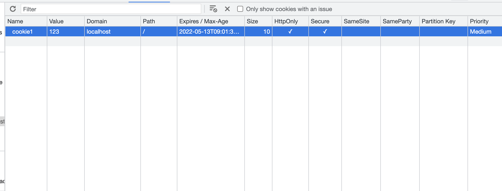

# 关于cookie你所需要知道的

大家都知道HTTP是stateless的，但B/S应用很多时候我们需要在B和S端维护一些状态，最常见的比如用户登陆状态。那么如何在stateless的HTTP协议下维护state就成了一个问题，于是就有了cookie和session的机制来进行客户端和服务端的状态共享。session通过将信息存储于server端，可以是落盘到文件系统，也可以通过一些中间件如redis缓存等从而实现跨instance的分布式共享。 而cookie则是存储在client端(浏览器)，在每次请求时将valid的cookie放到header中已实现状态共享，由于cookie存储在客户端，对server而言相当于用户输入或者说请求参数，并不如session那样可控和可信，很容易被黑客利用，最常见的如[CSRF](https://developer.mozilla.org/en-US/docs/Glossary/CSRF), 于是cookie有了很多attributes以增强自身安全性。

## 关于cookie的前置知识

在看cookie的attributes之前，需要对http的Same-origin机制和cookie的same-site机制做一个解释。

### Same-origin policy & same-site

**Same-origin**(同源策略)：如果两个URL的`protocol`,`host`,`port`(即协议、域名、端口)完全相同则为同源，否则就跨源(跨域)了。

| Url1                          | Url2                          | is same-origin? |
| ----------------------------- | ----------------------------- | --------------- |
| http://www.company.com        | https://www.bing.com          | No              |
| http://store.company.com      | https://news.company.com      | No              |
| https://store.company.com/a/1 | https://store.company.com/c/2 | Yes             |

**Cross-origin的结果：**

- 不能获取 Cookie、LocalStorage、IndexedDB；
- 不能获取 dom 节点；
- 不能进行非简单请求；

CORS 分为[Simple requests](https://developer.mozilla.org/en-US/docs/Web/HTTP/CORS#simple_requests)(简单请求)以及非简单请求:

- 简单请求： `POST`、`GET`、`HEAD`，TRACE

- 非简单请求 `PUT`、`DELETE`

`Non-Same-origin`(非同源)的`Non-Simple request`(非简单请求)是不被直接允许的，需要进行[CORS preflight](https://developer.mozilla.org/en-US/docs/Glossary/Preflight_request)验证server是否允许origin 访问目标资源。

但[node-fetch]((https://github.com/node-fetch/node-fetch))并不遵循这一套规范：

> https://developer.mozilla.org/en-US/docs/Web/HTTP/CORS
>
> Some requests don't trigger a [CORS preflight](https://developer.mozilla.org/en-US/docs/Glossary/Preflight_request). Those are called *simple requests*, though the [Fetch](https://fetch.spec.whatwg.org/) spec (which defines CORS) doesn't use that term. 

> https://fetch.spec.whatwg.org/#cors-request
>
> A CORS request is an HTTP request that includes an `[`Origin`](https://fetch.spec.whatwg.org/#http-origin)` header. It cannot be reliably identified as participating in the [CORS protocol](https://fetch.spec.whatwg.org/#cors-protocol) as the `[`Origin`](https://fetch.spec.whatwg.org/#http-origin)` header is also included for all [requests](https://fetch.spec.whatwg.org/#concept-request) whose [method](https://fetch.spec.whatwg.org/#concept-request-method) is neither ``GET`` nor ``HEAD``.

所以对于[**fetch**](https://github.com/node-fetch/node-fetch)来说，只要不是`GET`, `HEAD`和`OPTION(即preflight its self)`, 都会进行preflight验证。

可能看上去比较绕，那么经过我的测试，结合上述(MSDN抄来的)其实总结起来就是:

对于非`GET`、`HEAD`，TRACE，`OPTIONS`的请求，在cross-origin的情况下浏览器会先主动发一个preflight的请求(Method: OPTIONS)验证服务器是否允许该cross-origin的请求，server的配置是基于项目的需求由dev添加的，如:

```
# nginx
location /api {
	add_header 'Access-Control-Allow-Origin' "$http_origin";
	proxy_pass http://api.cross-site.com;
}
# express

```

此时response会返回`Access-Control-Allow-Origin `这个header，如果他的值是你的origin的url那么即validted，此时浏览器才发送真实的请求。

[**same-site**](https://developer.mozilla.org/en-US/docs/Glossary/Site)(同站): 只要两个 URL 的 [eTLD](https://en.wikipedia.org/wiki/Public_Suffix_List#:~:text=Entries%20on%20the%20list%20are,Mozilla%20Public%20License%20(MPL).)(effective top-level domains 有效顶级域名 eg. .com、.co、.uk、.github.io)+1 相同即为same-site，可以不考虑协议和端口(依赖于浏览器的实现)。

| Url1                     | Url2                     | is same-site? |
| ------------------------ | ------------------------ | ------------- |
| http://www.company.com   | https://www.bing.com     | No            |
| http://store.company.com | https://news.company.com | Yes           |
| http://example.com       | https://example.com      | Yes           |

> - Cookies from the same domain are no longer considered to be from the same site if sent using a different scheme (`http:` or `https:`).

```
"Same-site" and "cross-site" Requests

   A request is "same-site" if its target's URI's origin's registrable
   domain is an exact match for the request's initiator's "site for
   cookies", and "cross-site" otherwise.  To be more precise, for a
   given request ("request"), the following algorithm returns "same-
   site" or "cross-site":

   1.  If "request"'s client is "null", return "same-site".
   2.  Let "site" be "request"'s client's "site for cookies" (as defined
       in the following sections).
   3.  Let "target" be the registrable domain of "request"'s current
       url.
   4.  If "site" is an exact match for "target", return "same-site".
   5.  Return "cross-site".
```

```
attribute in a "Lax"
   enforcement mode that carves out an exception which sends same-site
   cookies along with cross-site requests if and only if they are top-
   level navigations which use a "safe" (in the [RFC7231] sense) HTTP
   method.
```

## cookie的组成

如果我们打开一个浏览器F12去看一下cookie，我们可以看到如下的attributes(chrome 为例):



其中 SameParty, Priority 都是google自己的chrome enhancement，PartitionKey则是firefox的，我就不研究这几个偏门了(一般也用不到且谨慎使用-兼容性)。

而Name，Value，Size就是字面意思，非常的semantic, 我就不解释了。

那么下面这几个就是非常common的且如果使用了cookie很可能需要考虑的attributes：

- Domain：指定cookie可共享的(registrable domain)域名范围=> 如果值以.开头，那么自身及subdomain都可以携带该cookie，如果没有显示指定，默认为origin的域名且同级子域名不可共享(即开头没有.只有它自己可以访问)`Domain`的值一定是registrable domain或他的subdomain。
- Path: URL的prefix match Path 才能携带该cookie，即路径本身和它的子路径可以携带eg. `/docs` match  `/docs/`, `/docs/Web/`
- Expires/Max-Age: 设置cookie过期时间，Expires指定过期日期，Max-Age指定时长，只需要设置一个，如果两个都设置，Max-Age为最终有效值
- HttpOnly: 禁止client的script访问和修改cookie，但script发起的请求仍有能力携带该cookie
- Secure: 只有用https的请求才将携带有Secure的cookie
- SameSite: 有三个可选值-Strict，Lax，None.
  - Strict: 只有same-site 的请求可以携带Strict的cookie
  - Lax: corss-site的简单请求携带cookie，非简单请求则不会携带
  - None: 最不安全的策略，cross-site的非简单请求也携带

目前的主流浏览器都将SameSite的default值设为了Lax，且如果SameSite设置为None，则必须指定Secure，即SameSite=None的cookie只可以在https请求中携带

