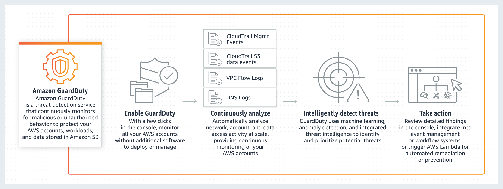
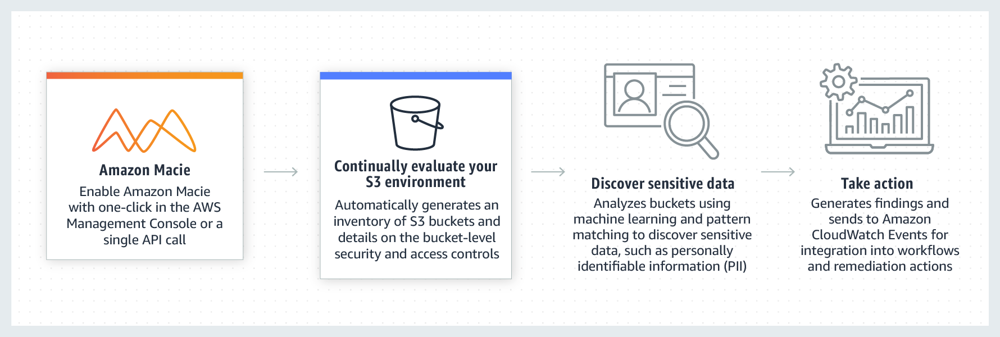

#### GuardDuty

Amazon GuardDuty is a threat detection service that continuously monitors your AWS accounts and workloads for malicious activity and delivers detailed security findings for visibility and remediation.

**Amazon EMR** 

Amazon EMR is the industry-leading cloud big data platform for processing vast amounts of data using open source tools such as Apache Spark, Apache Hive, Apache HBase, Apache Flink, Apache Hudi, and Presto.

**AWS Glue** 

AWS Glue is a fully managed extract, transform, and load (ETL) service that makes it easy for customers to prepare and load their data for analytics

**Amazon Macie**

Amazon Macie is a fully managed data security and data privacy service that uses machine learning and pattern matching to discover and protect your sensitive data on Amazon S3. Macie automatically detects a large and growing list of sensitive data types, including personally identifiable information (PII) such as names, addresses, and credit card numbers. It also gives you constant visibility of the data security and data privacy of your data stored in Amazon S3.

**AWS Step Functions** 

AWS Step Functions lets you coordinate multiple AWS services into serverless workflows so you can build and update apps quickly. Using Step Functions, you can design and run workflows that stitch together services, such as AWS Lambda, AWS Fargate, and Amazon SageMaker, into feature-rich applications. 

**X-Ray**

 AWS X-Ray helps developers analyze and debug production, distributed applications,. X-Ray provides an end-to-end view of requests as they travel through your application, and shows a map of your application’s underlying components.

can use X-Ray to collect data across AWS Accounts.

X-Ray agent can assume a role to publish data into an account different from the one in which it is running. 

### AWS Global Accelerator

- Works with Elastic IP, EC2 instances, ALB,NLB, public or private
- Intellignet routing to lowest latency and fast regional failover
- No issue with client catch
- Internal AWS network
- Global Accelerator performs a health check of your application
- Helps make your application global
- Great for disaster recovery
- Only 2 external IP need to be whitelisted
- DDos protection by AWS Shield

**AWS OpsWorks**

 is a configuration management service that provides managed instances of Chef and Puppet. Chef and Puppet are automation platforms that allow you to use code to automate the configurations of your servers. OpsWorks lets you use Chef and Puppet to automate how servers are configured, deployed and managed across your Amazon EC2 instances or on-premises compute environments.