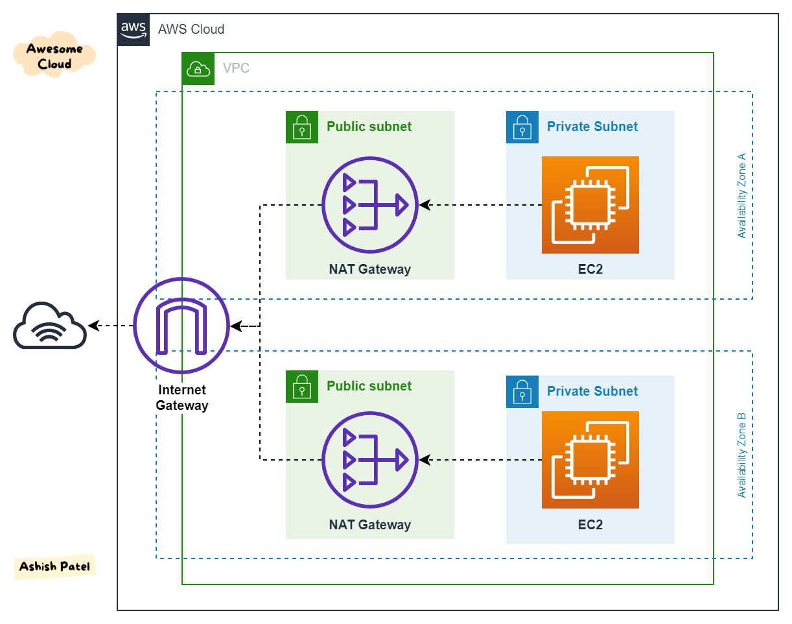

# VPC

vpc

Subnets

Routetable

### internet gateway(IGW)

- allow resources in a VPC connect to the internet
- Scales horizontally and is high available and redundent
- Must be create separately from a VPC
- One VPC can only be attached  to one IGW
- IGW on their own do not allow internet access
- Route table must also be edit, accossiate subnets to IGW

Internet Gateway (IGW) allows instances with public IPs to access the internet.
NAT Gateway (NGW) allows instances with no public IPs to access the internet.

### NAT Gateway

1. It allows resources in a private subnet to access the internet (think yum updates, external database connections, wget calls, OS patch, etc).
2. It only works one way. The internet at large cannot get through your NAT to your private resources unless you explicitly allow it.
3. Nat Gateway is rresilient within a single AZ, must create Multi NAT Gateway in Multi AZs for fault-tolerrance

### NAT Instance

outated

- NAT => Network Address Translation
- Allows EC2 instances in private subnets to connect to the internets
- Must launched in a public subnet
- Must disable EC2 setting: Source / destination check
- Must have Elastic IP attached to it
- Route Tables must be configured to route traficc from private subnets to the NAT Instance
- Internate traffic bandwidth depends on EC2 instance type
- self manage Security Groups & rules, Higly available configuration

### DNS Resolution in VPC

**DNS Resolution (enableDnsSupport)** `resolve dns within aws`

- Decides if DNS resolution from Route 53 Resolver server is supported for the VPC 
-  True (default): it queries the Amazon Provider DNS Server at 169.254.169.253 or the reserved IP address at the base of the VPC IPv4 network range plus two

**DNS Hostnames(enableDnsHostnames)** `enable public dns record`

- Wont do anything unless enableDnsSupport=true
- if true, puublic hostname to EC2 instance if it has a public IPv4
- Default VPC true as default, False for created VPCs
- If use custom DNS domain names in a Private Hosted Zone in Route 53, both enableDnsHostnames & enableDnsSupport be set to true

> Hosted Zone
>
> A hosted zone is a contianer that holds information about how you want to route traffic for a domain

### Security Group & NACLs

> NACLs are stateless but Security Groups are stageful(whatever is accepted in can also out)

- NACL(Network Access Control List) are like a firewall which control traffic from and to subnets
- One NACL per subnet, new subnets are assigned the default NACL

| Security Group                                               | NACLs                                                        |
| ------------------------------------------------------------ | ------------------------------------------------------------ |
| Operates at the instance level                               | Operates at the subnet level                                 |
| Supports allow rules only                                    | Supports allow rules and deny rules                          |
| StateFul: return traffic is automatically allowed, regardless of any rules | Stateless: return traffic must be explicitly allowed by rules(think of ephemeral ports) |
| All rules arre evaluated before decidingg whether to allow traffic | Rules are evaluated in order(lowest to highest) when deciding whether to allow traffic first match wins |
| Applies to an EC2 instance when specified                    | Automatically applied to all EC2 instance in the subnets that its associated with |

### VPC Peering

- Privately connect two vpcs using aws's network
- 

VPC endpoint

- Every AWS service is publicly exposed
- VPC endpoints allow you to connect to was services using a private network instead of using public internet
- they are redundant and seal horizontally

two types

- Interface Endpoints billed
  - Provisions ENI(private IP address) as an entry point (must attach a security Group)
  - Supports most aws services
- Gateway endpoints free
  - Provisions a gateway and must be used as a target in a route table
  - Supports both s3 and DynamoDB

he Amazon VPC console wizard provides the following four configurations:

1. VPC with a single public subnet 
2. VPC with public and private subnets (NAT)
3. VPC with public and private subnets and AWS Site-to-Site VPN access 
4. VPC with a private subnet only and AWS Site-to-Site VPN access 