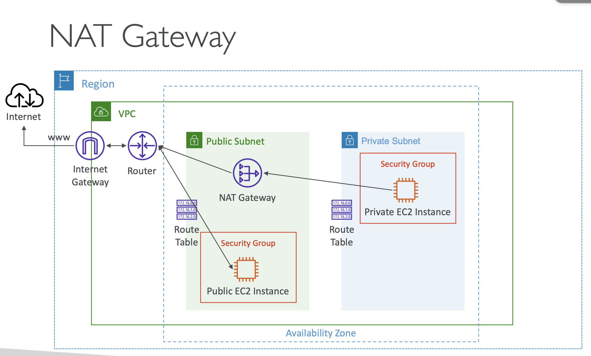
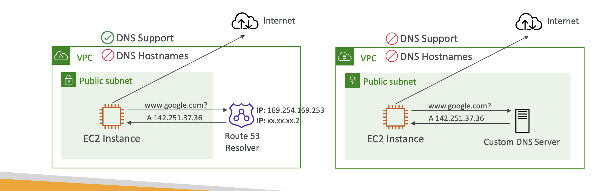
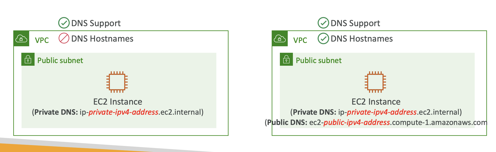

# VPC

vpc

Subnets

Routetable

### internet gateway(IGW)

- allow resources in a VPC connect to the internet
- Scales horizontally and is high available and redundent
- Must be create separately from a VPC
- One VPC can only be attached  to one IGW
- IGW on their own do not allow internet access
- Route table must also be edit, accossiate subnets to IGW

**Steps:**

1. create VPC
2. Create IGW -> attach IGW to VPC
3. Create Route Table -> attach Route Table to subnets underr VPC
4. Edit Route Table add CIDRs destination to IGW

Internet Gateway (IGW) allows instances with Public IPs to access the internet.
NAT Gateway (NGW) allows instances with Private IPs to access the internet.

### NAT Gateway

- It allows resources in a private subnet to access the internet (think yum updates, external database connections, wget calls, OS patch, etc).
- It only works one way. The internet at large cannot get through your NAT to your private resources unless you explicitly allow it.
- Nat Gateway is only resilient within a single AZ, must create Multi NAT Gateway in Multi AZs for fault-tolerrance
- Cant be used by EC2 instance in the same subnet(only from other subnets)
- Requirers an IGGW (outbound from Private Subnet => NATGW => IGW)

Steps:

1. create a NAT gateway => choose public subnets in which to create the NATGW(select multi for high availability) & allocate Elastic IP
2. edit Private Route Table, specify CIDRs and send to NATGW that you created above

### NAT Instance

outated

- NAT => Network Address Translation
- Allows EC2 instances in private subnets to connect to the internets
- Must launched in a public subnet
- Must disable EC2 setting: Source / destination check
- Must have Elastic IP attached to it
- Route Tables must be configured to route traficc from private subnets to the NAT Instance
- Internate traffic bandwidth depends on EC2 instance type
- self manage Security Groups & rules, Higly available configuration

### DNS Resolution in VPC

**DNS Resolution (enableDnsSupport)** `resolve dns within aws`

- Decides if DNS resolution from Route 53 Resolver server is supported for the VPC 
-  True (default): it queries the Amazon Provider DNS Server at 169.254.169.253 or the reserved IP address at the base of the VPC IPv4 network range plus two

**DNS Hostnames(enableDnsHostnames)** `enable public dns record`

- Wont do anything unless enableDnsSupport=true
- if true, puublic hostname to EC2 instance if it has a public IPv4
- Default VPC true as default, False for created VPCs
- If use custom DNS domain names in a Private Hosted Zone in Route 53, both enableDnsHostnames & enableDnsSupport be set to true

> Hosted Zone
>
> A hosted zone is a contianer that holds information about how you want to route traffic for a domain

### Security Group & NACLs

> NACLs are stateless but Security Groups are stageful(whatever is accepted in can also out)

- NACL(Network Access Control List) are like a firewall which control traffic from and to subnets
- One NACL per subnet, new subnets are assigned the default NACL

| Security Group                                               | NACLs                                                        |
| ------------------------------------------------------------ | ------------------------------------------------------------ |
| Operates at the instance level                               | Operates at the subnet level                                 |
| Supports allow rules only                                    | Supports allow rules and deny rules                          |
| StateFul: return traffic is automatically allowed, regardless of any rules | Stateless: return traffic must be explicitly allowed by rules(think of ephemeral ports) |
| All rules arre evaluated before decidingg whether to allow traffic | Rules are evaluated in order(lowest to highest) when deciding whether to allow traffic first match wins |
| Applies to an EC2 instance when specified                    | Automatically applied to all EC2 instance in the subnets that its associated with |

### VPC Peering

- Privately connect two vpcs using aws's network
- Make the behave as if they were in the same network
- Muust not have overlapping CIDRs
- VPC Peeringg connection is not transitive(must be established for each VPC that need to communicate with one another)
- must uupdate route tables in each VPC's subnets to ensuure EC2 instances can communicate with each other
- support cross accounts/regions
- Can reference a security group in a peered VPC(works cross accounts but same region)

### VPC endpoint

- Every AWS service is publicly exposed

- VPC endpoints allow you to connect to was services using a private network instead of using public internet

- they are redundant and seal horizontally

- It remove the need of IGW, NATGW,...to access AWS Services

- requriements

  - Check DNS setting resolution in VPC
  - Check Route Tables

  

**two type of endpoints**

- **Interface Endpoints** `billed`
  
  - Provisions ENI(private IP address) as an entry point (must attach a security Group)
  - Supports most aws services
  - Steps:
    1. Create endpoints
    2. select services
    3. Select VPC  in which the endpoint will be deploy
    4. Enable DNS name
    5. select AZ & subnets in which endpoint will be deploy
  
- **Gateway endpoints** `free`
  
  - Provisions a gateway and must be used as a target in a route table
  
  - Supports both s3 and DynamoDB
  
  - Steps:
  
    Steps:
  
    1. Create endpoints
    2. select services
    3. Select VPC  in which the endpoint will be deploy
    4. select route tables to update record to make any request from this route tables attached subnets will able to connect to this endpoint
    5. Select policy (full access or read only)

### VPC Flow Logs

- Capturer information about IP traffic going into interfaces:
  - VPC Flow Logs
  - Subnet Flow Logs
  - Elastic Network Interface(ENI) Flow Logs
- Helps to monitor & troubleShoot Connectivity issues
- Flow loggs data can go to S3/CloudWatch logs
- Captures network information from aws managed interfaces too: ELB, RDS, ElasticCache, Redshift, WorkSpaces, NATGW, Transit Gateway...

### Site-to-Site VPN

connect aws VPC to on-premises data center

- Virtual Private Gateway(VGW)
  - VPN concentrator on the aws side of the VPN connection
  - VGW is created and attached to the VPC from which you. want to create Site-to-Site VPN connection
  - Possibility to comitomize the ASN(autonomous System Number)
- Customer Gateway
  - Software application or physical device on customer side of the VPN connection

Notice:

- enable Route Propagation for the Virtual Private Gateway int the rouute table that is associated with your subnets
- add ICMP port to SG for ping to work

### CloudHub

- Provide secure communication between multiple sites, if you have multiple VPN connections
- Traffic goes over public internet
- Easy to setup, connect multiple on-premises Customer gateway  to same VGW, setup dynamic routing and config route tables

### Direct Connect(DX)

- Provides a dedicated private connection from a rremote network to your VPC
- Dedicated connection must be setup between your DC and AWS Direct Connect locations
- required to setup a Virtual Private Gateway on VPC
- Access both public  and Private resources on same connection
- Use Cases
  - Increase bandwidth throughput - workingg with large datas its - lower cost
  - More consistent network experience
  - Hybrid env
  - support both IPV4 &IPV6

he Amazon VPC console wizard provides the following four configurations:

1. VPC with a single public subnet 
2. VPC with public and private subnets (NAT)
3. VPC with public and private subnets and AWS Site-to-Site VPN access 
4. VPC with a private subnet only and AWS Site-to-Site VPN access 