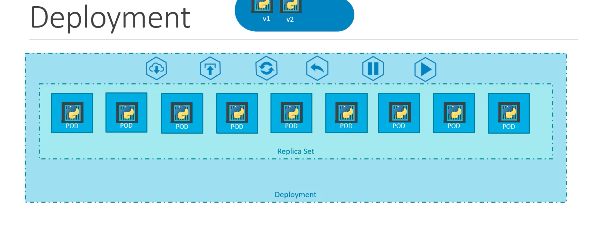

# kubernetes

### Cluster Architecture

Kubernetes cluster consists of a set of nodes that host applications in the form of containers

**work Node**: host application as containers

- Each node has multiple Pods on it
- 3 processes must be installed on every node
  - container runtime
  - Kubelet interacts with both - the container and node, kubelet start the pod with a container inside
  - Kube proxy: 

**Master node:** Manage, Plan Schedule, Monitor nodes

4 process run on every master node:

- Api server: as a cluster gateway, do authenticate
- scheduler
- Controller manager: detects cluster state changes
- Etc: data store


components

- Api server as the font end for kubernets, the users, management devices, commandline interface ll toked to the api server to interact with kubernetes cluster
- etcd store the data to manage cluster
- kubelet agent run on each node in the cluster make sure container are runing on the nodes as expected. 
- scheduler
- controller
- Container runtime


Pod: a pod is a single instance of an application, the smallest object that you can create in  k8s

Basic command:

```bash
kubectl run nginx-test --image=nginx # create a pod
kubectl get pods # get pods info
kubectl describe pod nginx # detailed info
kubectl get pods -o wide # get more info(include ip)
```

Configfile:

1. metadata
2. specification
3. Status(automatically generated by k8s)

通过yaml文件启动

```yaml
apiVersion: v1
kind: Pod
metadata:
  name: pod-definition
  labels:
    app: pod-definition-container
    type: test

spec:
  containers:
    - name: nginx-container
      image: nginx

```

command

```bash
kubectl create -f fie_name.yml
kubectl apply -f file_name.yml
kubectl run redis --image=redis123 --dry-run=client -o yaml > pod.yaml # generate yaml file
kubectl edit pod pod_name # edit pod
```


## Replica commands:

```bash
kubectl create -f replicate-definition.yml # create replica
kubectl get replicaset # get info
kubectl delete replicaset name #del
kubectl replace -f replicate-definition.yml # update
kubectl scale -replicas=6 -f replicate-definition.yml # update, file wont change
```

Replicates sample:

```yaml
apiVersion: apps/v1
kind: ReplicaSet
metadata:
  name: replicaset-app
  labels:
    app: replicatset
spec:
  selector:
    matchLabels:
      app: replicaset-app
  replicas: 3
  template:
    metadata:
      name: nginx-replica-set
      labels:
        app: replicaset-app
    spec:
      containers:
        - name: nginx
          image: nginx

```


## Deployment




Layers of abstraction

- Deployment manage pods

## network


### Service

> An abstract way to expose an application running on a set of [Pods](https://kubernetes.io/docs/concepts/workloads/pods/) as a network service.
>
> Kubernetes gives Pods their own IP addresses and a single DNS name for a set of Pods, and can load-balance across them.

 an object   like pods, listen a port on the node and forward the request to a port on the pod


Service types:

- NodePort
- ClusterIp
- LoadBalancer


Scale:

```bash
kubectl scale -n default deployment express-learn-deployment --replicas=4
```


## volumes

Persistent Volume

Persistent Volume Claim

Storage Class

Storage doesn't depend on the pod lifecycle

Storage available on all nodes

Storage needs to service even if cluster crashes

PV outside of the namespaces and can accessible to the whole cluster


Local storage and remote storage

