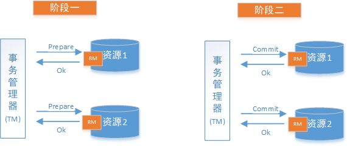
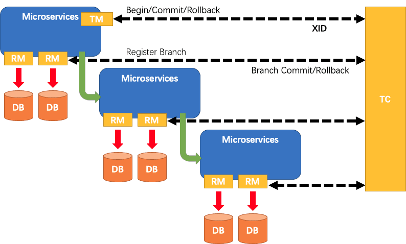

# Distribution Transaction

## 基础概念

### 事务

 你给女朋友发红包，你的账户余额减少的同时女朋友账户余额增多，这两个动作需要是一个原子操作，及要么全部成功，要么全部失败。

**事务可以看做是一次大的活动，它由不同的小活动组成，这些活动要么全部成功，要么全部失败。**

### 本地事务

在我们开发的单体应用中事务主要靠关系数据库来控制，而数据库通常和应用在同一个服务器，所以基于关系型数据库的 事务又被称为本地事务。即数据库自身的事务能力我们在分布式系统中称其为分布式事务。

> 通过关系型数据库的事务特性来控制事务的方式称为本地事务

### 分布式事务

分布式事务是单体应用向多节点服务转变中产生的产物，多节点服务使得一个完整流程的业务跨JVM，跨数据库实例，跨数据库连接等，数据库自带的事务只针对同一个不同数据源有效，使得跨数据源的事务需要通过分布式事务的方式实现。

> 分布式事务产生的场景
>
> 1. 跨JVM进程产生分布式事务
>
> 2. 跨数据库实例产生分布式事务
>
> 3. 跨数据库连接产生分布式事务

### CAP 原则

又称 CAP 定理，指的是在一个分布式系统中， `Consistency`(一致性)、 `Availability`(可用性)、`Partition tolerance`(分区容错性)，三者不可得兼。

1. **Consistency**(一致性)： 在分布式系统中，一个节点已提交的写操作都可以立即被其他任意节点查询到数据的最新状态。

   > 一致性的实现：
   >
   > 1. 写入master数据库后要将数据同步到slave数据库。 
   > 2. 写入master后，在向slave同步期间要将slave锁定，待同步完成后再释放锁，以免在新数据同步完成前从slave查询到旧的数据。
   >
   > 分布式系统一致性的特点： 
   >
   > 1. 由于存在数据同步的过程，写操作的响应会有一定的延迟。 
   >
   > 2. 为了保证数据一致性会对资源暂时锁定，待数据同步完成释放锁定资源。 
   >
   > 3. 如果请求数据同步失败的结点则会返回错误信息，一定不会返回旧数据。

2. **Availability**(可用性): 任何操作都可以得到响应结果，并且不会出现超时或响应错误。

   >可用性的实现
   >
   >1. 写入master数据库后要将数据同步到slave数据库。 
   >2. 由于要保证从数据库的可用性，不可将从数据库中的资源进行锁定。 
   >3. 即时数据还没有同步过来，从数据库也要返回要查询的数据，哪怕是旧数据，如果连旧数据也没有则可以按照约定返回一个默认信息，但不能返回错误或响应超时。 
   >
   >分布式系统可用性的特点： 
   >
   >1. 所有请求都有响应，且不会出现响应超时或响应错误。

3. **Partition tolerance(**分区容错性)：由于分布式系统节点部署在不同的网络中，存在网络分区，可能因网络问题导致节点间的通信失败，但此时仍可以对外提供服务。分区容忍性是分布式系统具备的基本能力

   > 分区容忍性的实现： 
   >
   > 1. 尽量使用异步取代同步操作，例如使用异步方式将数据从主数据库同步到从数据，这样结点之间能有效的实现 松耦合。 
   > 2. 添加从数据库结点，其中一个从结点挂掉其它从结点提供服务。 
   >
   > 分布式分区容忍性的特点： 
   >
   > 1. 分区容忍性分是布式系统具备的基本能力。 

CAP 原则的精髓就是要么 AP，要么 CP，要么 AC，但是不存在 CAP。应用最多得是AP

- AP: 放弃强一致性，追求分区容错和可用性，这也是如今很多分布式系统的选择，通常AP只是在一定时间内不是最新但最终会保证最终的一致性，很多我们熟悉的业务场景如转账24小时到账，退款规定时间内到账等。
- CP：放弃可用性，追求强一致性和分区容错性，在强一致性下由于锁机制而不可避免的出现超时等现象，系统容忍超时等系统报错，从而保证强一致性。
- CA： 放弃分区容错性，满足一致性和可用性，其实不进行分区即传统的单体应用就是很好的例子。

### BASE理论

BASE 是 `Basically Available`(基本可用)、`Soft state`(软状态)和 `Eventually consistent` (最终一致性)三个短语的缩 写。BASE理论是对CAP中AP的一个扩展，通过牺牲强一致性来获得可用性，允许数据在一段时间内是不一致的，但最终都达到一致性状态，满足BASE理论的事务称为“**柔性事务**”

- **基本可用**: 分布式系统在出现故障时，通过允许部分功能不可用来保证核心功能可用。如，电商网站交易付款出现问题了，商品依然可以正常浏览。 

- **软状态**: 由于不要求强一致性，BASE允许系统中存在中间状态（即软状态），这个状态不影响系统可用 

  性，如订单的"支付中"、“数据同步中”等状态，待数据最终一致后状态改为“成功”状态。 

- **最终一致**: 最终一致是指经过一段时间后，所有节点数据都将会达到一致。如订单的"支付中"状态，最终会变 

  为“支付成功”或者"支付失败"，使订单状态与实际交易结果达成一致，但需要一定时间的延迟、等待。 

## 分布式事务的解决方案

常见的分布式事务解决方案通常有如下几种：

1. 2PC(两阶段提交)

2. TCC(Try、Confirm、Cancel)
3. 可靠消息最终一致性
4. 最大努力通知

### 分布式事务解决方案 - 2PC(两阶段提交)

2PC将整个事务流程分为两个阶段: 准备阶段(Prepare phase)、提交阶段(commit phase);具体流程如下：

1. 准备阶段(Prepare phase): 事务管理器给每个事务参与者发送Prepare消息，每个参与者在本地执行事务，并写本地的Undo-log/Redo-log，此时事务还未提交

2. 提交阶段(commit phase): 当事务管理器收到任意参与者的执行失败或超时消息时，直接给每个事务参与者发送回滚(Rollback)消息，否则发送提交(Commit)消息。事务参与者根据事务管理器的指令进行提交或回滚操作，并在最后阶段释放事务处理工程中使用的锁资源。

   事务成功流程:

   

   事务失败流程:

   

   

#### 实现方案1 - XA方案

2PC的传统方案是在数据库层面实现的，如Oracle、MySQL都支持2PC协议，为了统一标准减少行业内不必要的对接成本，需要制定标准化的处理模型及接口标准，国际开放标准组织Open Group定义了分布式事务处理模型**DTP**（Distributed Transaction Processing Reference Model） 。

DTP模型定义如下角色：

**AP**(Application Program)：即应用程序，可以理解为使用DTP分布式事务的程序。

**RM**(Resource Manager)：即资源管理器，可以理解为事务的参与者，一般情况下是指一个数据库实例，通过资源管理器对该数据库进行控制，资源管理器控制着分支事务。

**TM**(Transaction Manager)：事务管理器，负责协调和管理事务，事务管理器控制着全局事务，管理事务生命周期，并协调各个RM。**全局事务**是指分布式事务处理环境中，需要操作多个数据库共同完成一个工作，这个 工作即是一个全局事务。

DTP模型定义TM和RM之间通讯的接口规范叫**XA**，简单理解为数据库提供的2PC接口协议，**基于数据库的XA协议来实现2PC又称为XA方案。**

以上三个角色之间的交互方式如下：

1.  TM向AP提供 应用程序编程接口，AP通过TM提交及回滚事务。

2.  TM交易中间件通过XA接口来通知RM数据库事务的开始、结束以及提交、回滚等。

总结：

整个2PC的事务流程涉及到AP、RM、TM三个角色。AP指的是使用2PC分布式事务的应用程序；RM指的是资源管理器，它控制着分支事务；TM指的是事务管理器，它控制着整个全局事务。

1.  在**准备阶段**RM执行实际的业务操作，但不提交事务，资源锁定；

2.  在**提交阶段**TM会接受RM在准备阶段的执行回复，只要有任一个RM执行失败，TM会通知所有RM执行回滚操 作，否则，TM将会通知所有RM提交该事务。提交阶段结束资源锁释放。

XA方案的问题：

1. 需要本地数据库支持XA协议。

2. 资源锁需要等到两个阶段结束才释放，性能较差。

#### 实现方案2 - Seata的AT方案方案

Seata是阿里的一款分布式事务解决方案的应用层中间件，它以高效并且对业务0侵入的方式解决微服 务场景下面临的分布式事务问题，集成了AT模式(即2PC)、TCC模式、SAGA 模式等多种事务模式，以下是在Seata中几个重要的概念：

TM: 事务管理器: 嵌入到应用中，负责事务的开启，提交，回滚。

RM：管理分支事务，进行分支注册、状态汇报，接收事务协调器TC的指令来驱动分支（本地）事务的提交和回滚。

TC：事务协调器：是一个独立的中间件，需要独立部署运行，用来维护全局事务的运行状态。接收TM指令发起全局事务的提交与回滚，负责与RM通信协调各各分支事务的提交或回滚。

Seata把一个分布式事务拆分为一个包含若干个分支事务的全局事务，通过全局事务管理其下的分支事务进行提交/回滚操作，Seata通过关联数分支事务的本地事务来驱动完成全局事务，分支事务是一个关系型数据库的本地事务，通过proxy代理在操作程序本身的数据库操作业务外还进行对undo_log表的操作，这两个数据库操作封装到一个本地事务中，TM以undo_log表中的数据为依据进行事务的提交/回滚操作。

我们可以通过上面的架构图来分析一个分布式事务的具体执行流程：

1. 在需要开启全局事务的方法上标注`@GlobalTransactional`注解后程序会在执行到该方时服务的TM向TC申请开启一个全局事务，TC服务创建全局事务成功后返回一个全局唯一的XID，事务范围内的RPC会携带这个XID，其他服务的数据库操作需要在分支事务方法上标注`@Transaction`注解。
2. 分支事务的RM向TC注册分支事务，将分支事务归入XID对应的分布式事务下的子事务进行管理
3. 每一个分支事务根据执行结果向XID的全局事务提交`commit`/`rollback`决议
4. TC通过TM的提交进行全部分支事务的完成提交/回滚