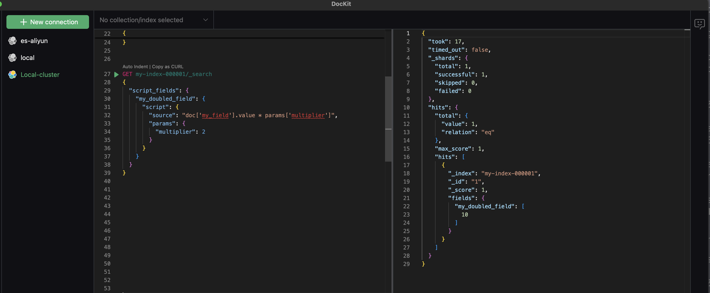
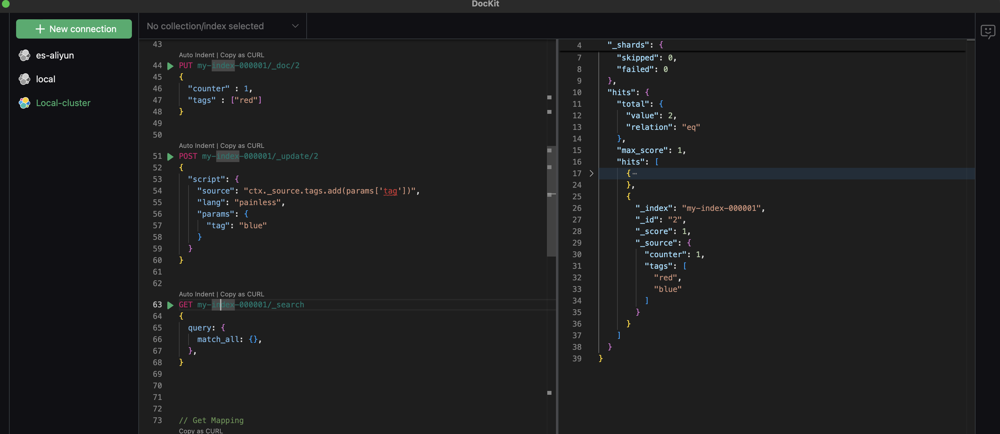

# Elasticsearch Scripting - Painless

通常情况下ElasticSearch 查询 - Query DSL 已经可以满足绝大部分的查询场景，但对于一些复杂的动态查询或需要对文档中的字段做解构等复杂匹配时Scripting功能就能很好的实现这一功能了。Painless是elasticsearch专门为elasticsearch场景下设计的脚本语言， 具有安全，简单且高性能的特点。

## 如何使用Painless

我们首先来看一下Painless的标准格式：

```json
  "script": {
    "lang":   "...",
    "source" | "id": "...",
    "params": { ... }
  }
```

**lang**: 用来定义该script所使用的语言，默认为Painles。

> lang 还原生支持`expression`， `mustache`以及通过插件支持`java`， 但`Painless`作为官方默认选项提供了更好的支持以及性能表现。

**source/id**：指定source或id来声明要执行的脚本。

> scripting 可以通过`PUT _scripts` 编译存储在Elasticsearch中，通过id直接使用

**params**：用来传递source中用到的参数，通过参数进行变量传递可以减少脚本编译次数从而提升执行性能


## 使用案例

### 用Painless脚本操作查询结果

首先先创建一个简单的document：

```json
PUT my-index-000001/_doc/1
{
  "my_field": 5
}
```

然后就可以通过使用script来拿到my_field * 2 的查询结果：

```json
GET my-index-000001/_search
{
  "script_fields": {
    "my_doubled_field": {
      "script": { 
        "source": "doc['my_field'].value * params['multiplier']", 
        "params": {
          "multiplier": 2
        }
      }
    }
  }
}
```

仔细阅读上面的query，script中的source语句使用`doc['my_field'].value` 来读取document中`my_field`字段的值，同时通过`params['multiplier']`读取传入的参数，这样做的好处是入参的改变不会导致source脚本的重新编译，从而提升性能。

最终我们可以在DocKit中看到查询结果`my_doubled_field`的值变成了10：



### 用Painless脚本更新document

可以在`_update`api中使用script来使用Painless进行字段的动态更新，如我们可以给一个array类型的tags字段通过update语句添加一个新的tag

```json
// 首先添加一个sample数据
PUT my-index-000001/_doc/2
{
  "counter" : 1,
  "tags" : ["red"]
}
// 通过更新添加一个新的tag
POST my-index-000001/_update/2
{
  "script": {
    "source": "ctx._source.tags.add(params['tag'])",
    "lang": "painless",
    "params": {
      "tag": "blue"
    }
  }
}
```

最终我们可以在DocKit中看到查询结果`tags`的值变成了两个成员` [ "red", "blue"]`：



### 用Painless脚本解构数据

当一个字段中包含复合内容时，如一条未解析的直接存储的日志，一条iot设备上传的状态数据等，我们可以在插入前进行解析，也可以通过脚本在查询时进行解构获取或操作目标数据段。

Elasticsearch提供了两个方法对数据进行解构：

1. Grok: 一种正则表达式的方言，构建与正则表达式之上但提供了更加符合Elasticsearch下的抽象
2. Dissect：通过解析字段的格式，基于分隔符对一条符合内容进行解构拆分从而获得所需要的数据

#### 用Grok从日志中解析出ip地址

我们可以参考官方的案例，通过Grok从Apache日志中拿到ip地址

1. 创建index

   ```json
   PUT my-index-apache-log/
   {
     "mappings": {
       "properties": {
         "@timestamp": {
           "format": "strict_date_optional_time||epoch_second",
           "type": "date"
         },
         "message": {
           "type": "wildcard"
         }
       }
     }
   }
   ```

2. 用bulk插入sample数据

   ```json
   POST my-index-apache-log/_bulk?refresh
   {"index":{}}
   {"timestamp":"2020-04-30T14:30:17-05:00","message":"40.135.0.0 - - [30/Apr/2020:14:30:17 -0500] \"GET /images/hm_bg.jpg HTTP/1.0\" 200 24736"}
   {"index":{}}
   {"timestamp":"2020-04-30T14:30:53-05:00","message":"232.0.0.0 - - [30/Apr/2020:14:30:53 -0500] \"GET /images/hm_bg.jpg HTTP/1.0\" 200 24736"}
   {"index":{}}
   {"timestamp":"2020-04-30T14:31:12-05:00","message":"26.1.0.0 - - [30/Apr/2020:14:31:12 -0500] \"GET /images/hm_bg.jpg HTTP/1.0\" 200 24736"}
   {"index":{}}
   {"timestamp":"2020-04-30T14:31:19-05:00","message":"247.37.0.0 - - [30/Apr/2020:14:31:19 -0500] \"GET /french/splash_inet.html HTTP/1.0\" 200 3781"}
   {"index":{}}
   {"timestamp":"2020-04-30T14:31:22-05:00","message":"247.37.0.0 - - [30/Apr/2020:14:31:22 -0500] \"GET /images/hm_nbg.jpg HTTP/1.0\" 304 0"}
   {"index":{}}
   {"timestamp":"2020-04-30T14:31:27-05:00","message":"252.0.0.0 - - [30/Apr/2020:14:31:27 -0500] \"GET /images/hm_bg.jpg HTTP/1.0\" 200 24736"}
   {"index":{}}
   {"timestamp":"2020-04-30T14:31:28-05:00","message":"not a valid apache log"}
   
   ```

3. 通过Painless脚本用grok解构出ip地址并获取查询结果

   ```json
   GET my-index-apache-log/_search
   {
     "runtime_mappings": {
       "clientip": {
         "type": "ip",
         "script": """
           String clientip=grok('%{COMMONAPACHELOG}').extract(doc["message"].value)?.clientip;
           if (clientip != null) emit(clientip); 
         """
       }
     },
     "query": {
       "exists": {
         "field": "clientip"
       }
     },
     "fields" : ["clientip"]
   }
   ```

#### 用Dissect从日志中解析出response的状态码

我们可以使用上一个Grok案例中的案例数据，查询出message中包含的statuscode

```JSON
GET my-index-apache-log/_search
{
  "runtime_mappings": {
    "responseCode": {
      "type": "long",
      "script": """
        String response=dissect('%{clientip} %{ident} %{auth} [%{@timestamp}] "%{verb} %{request} HTTP/%{httpversion}" %{response} %{size}').extract(doc["message"].value)?.response;
        if (response != null) emit(Integer.parseInt(response));
      """
    }
  },
  "query": {
    "exists": {
      "field": "responseCode"
    }
  },
  "fields" : ["responseCode"]
}
```

我们用dissect定义了message值的结构，并将解析出来的status code转为long类型的值。

> 可以简化读取document值的操作：读取document的field: doc['my_field'].value => field('my_field').get(<default_value>) => $(‘field’, <default_value>)


## 最佳实践

- TBC


refer: https://www.elastic.co/guide/en/elasticsearch/reference/current/scripting-field-extraction.html
