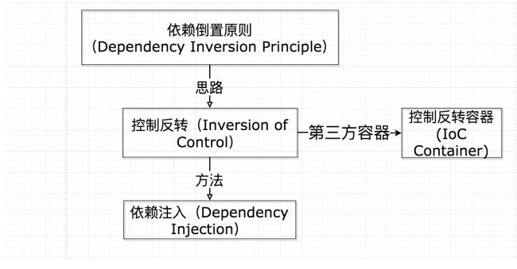

# IOC

## 设计模式7大原则

- 开放-封闭原则

- 单一职责原则

  > 一个类/接口/方法只负责一项职责

- 依赖倒置原则

  > 高层建筑决定需要什么，底层去实现这样的需求，但高层并不用管底层是怎么实现的
  >
  > 高层模块不应该依赖底层模块,二者都应该依赖其抽象
  >
  > 抽象不依赖细节, 细节依赖抽象
  >
  > 针对接口编程,不要针对实现编程

- 最小知识原则

- 接口隔离原则

  > 用多个专门的接口,而不使用单一的总接口
  >
  > 客户端不应该依赖他不需要的接口
  >
  > 适度原则

- 合成/聚合复用原则

- 里氏代换原则

- 迪米特原则

  > 一个对象应该对其他对象保持最少的了解, 又叫最少知道原则
  >
  > 降低类与类之间的耦合

ioc是依赖倒置原则的一种代码设计思路

依赖注入，就是把底层类作为参数传入上层类，实现上层类对下层类的“控制”

container的作用在于解决了初始化时无需手动new大量实例，可以自动  
手动new时从下往上一个一个的new，在container中，自动从上层递归查找依赖，查找完毕后从下往上new instance

[原文链接](https://cloud.tencent.com/developer/article/1428838)

