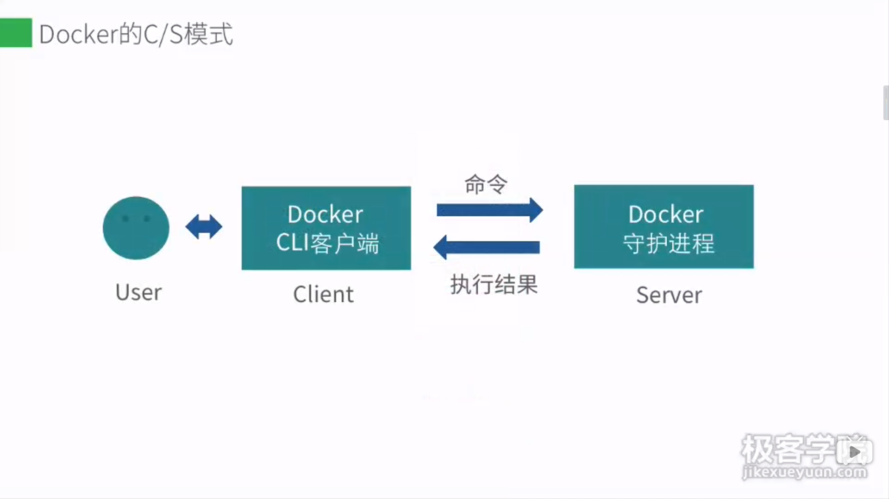

# Docker

## docker的c/s模式




##remote API


docker的守护进程通过soket与客户端进行连接 --- docker可以远程连接

## docker 守护进程

status docker 查看docker守护进程

sudo service docker start、restart 

docer启动配种文件  /etc/default/docker

ps -ef | grep docker

## docker的远程访问

docker客户端与守护进程的访问

1. 两台主机，第二台安装docker的服务器

2. 修改docker守护进程启动选项，区别服务器

   在ubuntu16.04及其他使用systemd方式的配置，应该修改systemd配置文件，ubuntu16.04中，在/lib/systemd/system/dockekr.service中ExecStart 追加参数--label name=docker_server_1,然后重新加载配置

   ``systemctl daemon-reload``

   ``service restart docker,``

   ``docker info``

3. 保证client API与Server API版本一致 

    -H docker远程守护进程配置

   DOCKER_HOST 远程连接配置

## docker file

注释   # 注释内容

指令 FROM #大写的为指令

```dockerfile
#First Dockerfile
FROM ubuntu:14.04
MAINTAINER dormancypress  "dormancypress@outlook.com"
RUN apt-get update
RUN apt-get install -y nginx
EXPOSE 80
```

FROM指令

```dockerfile
FROM <image>
FROM <image>:<tag>
```

- 已经存在的镜像
- 基础镜像
- 必须是一条非注释指令

MAINTAINER指令

```dockerfile
MAINTAINER <info>
#指定作者信息
```

RUN指令

指定当前镜像中运行的命令

```dockerfile
RUN <command> #shell模式
RUN ["executable", "param1", "param2"] #exec模式
```

EXPOSE命令

指定运行该镜像的容器使用的端口

```dockerfile
EXPOSE <port> [<port>...]
```

在通过dockerfile指定端口后，仍需要在docker run的时候指定端口映射，否则不能使用端口

RUN指令和CMD指令的区别： run指令是在容器构建过程中执行的，cmd指令是在容器运行中执行的cmd指定命令容器运行的默认环境 

CMD命令

```dockerfile
CMD ["executable", "param1", "param2"] #exec模式
CMD command param1 param2 #shell模式
```

ENTRYPOINT命令

```dockerfile
ENTRYPOINT ["executable", "param1", "param2"]#exec模式
ENTRYPOINT command param1 param2  #shell模式
#可以使用docker run --entrypoint覆盖
```

ADD和COPY 命令

```dockerfile
ADD <src> <dest>  
ADD ["<src>" "<dest>"]#适用于文件路径中有空格的情况

COPY <src> <dest> 
COPY ["<src>" "<dest>"]#适用于文件路径中有空格的情况
```

WORKDIR命令

```dockerfile
WORKDIR /path/to/workdir 
#指定在由镜像创建一个容器时，指定容器的工作目录
#ENTRYPOINT 和CMD 指定的命令都会在这个目录下执行
```

ENV指令

```dockerfile
ENV <key> <value>
ENV <key>=<value>....
```

USER指令 指定以什么用户来执行命令，默认是root

```dockerfile
USER deamon
```

ONBUILD[INSTRUCTION]指令

### dockerfile构建过程

1. 从基础镜像运行一个容器
2. 执行一条指令，对容器做出修改
3. 执行类似docker commit的操作，提交一个新的镜像层
4. 基于提交的镜像层运行一个新的容器
5. 执行dockerfile中的下一条指令，直至所有指令执行完毕

docker history [image] 查看dockerfile构建过程

## docker容器的网络连接

docker0 Linux的网桥 -是数据链路层成的一种设备[osi]


Linux虚拟网桥的特点

- 可以设置IP地址
- 相当于拥有了一个隐藏的虚拟网卡

安装网桥管理工具

sudo apt-get install bridg-utils

### docker容器之间的连接

docker容器默认允许所有容器互相连接 

容器重启会改变容器的ip

--link选修指定


## docker容器与外部网络的连接

ip-forward 是否允许数据转发

ipdtables 与Linux内核集成的包过滤防火墙系统


## docker容器的数据管理

### docker数据卷[data volume]

docker数据卷是经过特殊设计的目录，可以绕过联合文件(ufs)，为一个或多个容器提供访问

数据卷设计的目的，在于数据的永久化，它完全独立于容器的生命周期，因此docker不会再容器删除时删除其挂载的数据卷，也不会存在类似的垃圾收集机制，对容器引用的数据卷进行处理


#### 数据卷的特点

- 数据卷在容器启动时初始化，荣光容器使用的镜像在挂载点包含了数据，数据会拷贝到新的初始化的数据卷中
- 数据卷可以在容器之间共享和重用
- 可以对数据卷中的内容直接进行修改
- 数据卷的变化不会影响镜像的更新
- 卷会一直存在，即使挂载数据卷的容器已经被删除


### docker数据卷容器

数据卷容器： 命名的容器挂载数据卷，其他容器通过挂载这个容器实现数据共享，挂载数据卷的容器，就叫做数据卷


