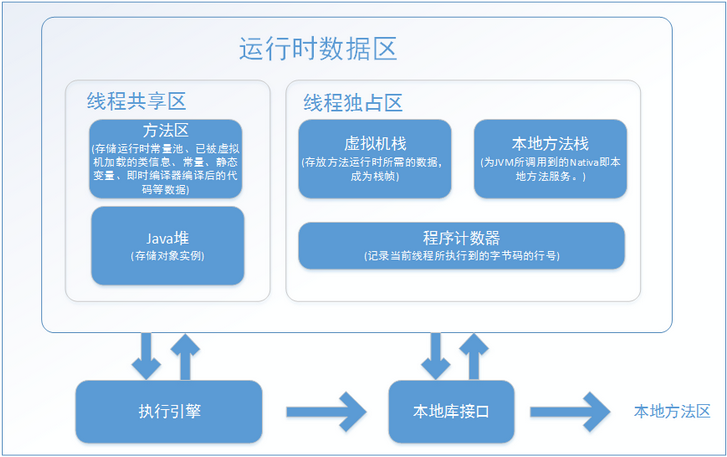

# JVM运行时数据区

java虚拟机在执行java程序的过程中会把它所管理的内存划分为若干不同的数据区域

java虚拟机运行时的数据区域

**程序计数器(Program Counter Register):** 当前线程所执行的字节码的行号指示器, 通过改变计数器的值来选取下一条需要执行的字节码指令

> 执行java方法时: 记录正在执行的虚拟机字节码指令地址
>
> 执行Native方法: 计数器的值为空

**java虚拟机栈(Java Virtual Machine Stacks):** 描述java方法执行的内存模型:每个方法被执行时创建一个栈帧(Stack frame), 用于存储局部变量表,操作栈,动态链接,方法出口等信息,每个方法的执行过程,对弈着一个栈帧在虚拟机栈中从入栈到出栈的过程.

> 局部变量表存放编译期间可知的各种基本数据类型[^1],对象引用,returnAddress[^2]类型
>
> 局部变量表所需的内存空间在编译期间完成分配,在方法执行期间不会改变局部变量表的大小

**本地方法栈(Native Method Stacks)**: 为虚拟机使用到的native方法服务,HotSpot直接把本地方法栈和虚拟机栈合二为一

**java堆(Java Heap):** 一块被所有线程共享的内存区域,在虚拟机启动时创建,唯一目的就是存放对象实例

**方法区(Method Area):** 各个线程共享的区域, 用于存储已被虚拟机加载的类型信息, 常量, 静态变量,即时编译器编译后的代码缓存等数据

运行时常量池(Runtime Constant Pool): 方法区的一部分,Class文件中的常量池表(Constant Pool Table)的内容在类加载时存放到方法区的运行时常量池中

> 并非预置入class文件中常量池的内容才能进入方法区运行时常量池,运行期间也可以将新的常量放入运行池中.

对象的内存布局:

在HotSpot虚拟机中,对象在堆内存中的存储布局分为三部分: 对象头(Header), 实例数据(Instance Header)和对齐填充(Padding)

在jdk8以后,永久代便完全退出了历史舞台,元空间作为其替代物登场

可作为GC Roots对象的种类:

1. 虚拟机栈(栈帧中的本地变量表)

[^1]: boolean, byte, char, short, int, float, long, double
[^2]: 直线一条字节码指令地址