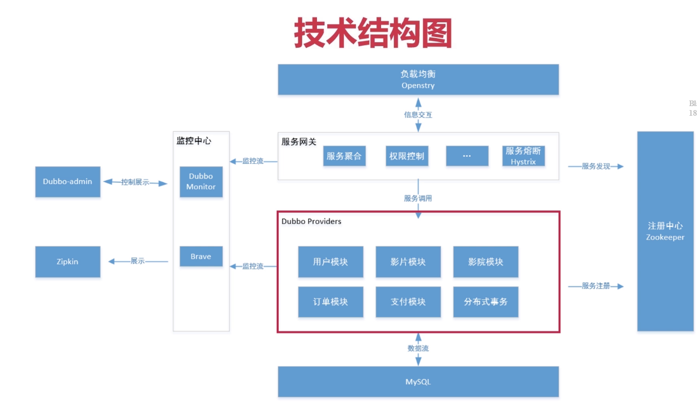

# 搭建dubbo环境

- provider: 服务提供者,提供服务实现

- consumer: 服务调用者,调用provider提供的服务实现

  > 同一个服务既可以时provider,又是consumer 

- Registory 服务注册与发现的注册中心,通常使用Zookeeper

- Monitor 统计服务的调用次数与调用时间的监控中心

- Container 服务运行容器

## 构建dubbo业务平台

