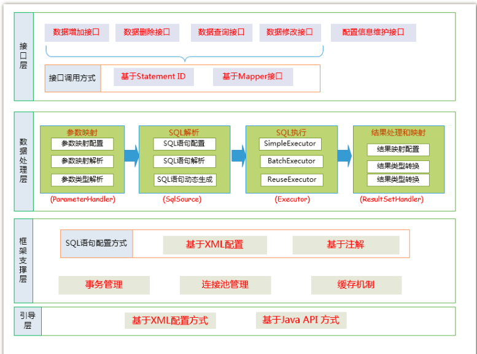

# MyBatis



### 接口层

接口层主要定义的是与数据库进行交互的方式。在Mybatis中，交互分为两种方式。

- Mybatis提供的API

  使用Mybatis提供的API进行操作，通过获取SqlSession对象，然后根据Statement Id 和参数来操作数据库。

  ```java
  String statement = "com.viewscenes.netsupervisor.dao.UserMapper.getUserList";
  List<User> result = sqlsession.selectList(statement);
  ```

- 使用Mapper接口

### 数据处理层

Mybatis的核心，负责参数映射和动态SQL生成，生成之后Mybatis执行SQL语句，并将返回的结果映射成自定义的类型。

### 框架支持层

- 事务管理: Mybatis通常与spring配合使用，更多的使用spring来管理事务
- 连接池
- 缓存
  - 一级缓存: <font color="red">默认开启</font>，SqlSession级别缓存，在同一个SqlSession中第一次sql执行完毕后将查询结果写入到缓存中，第二次直接从缓存中读取，从而提高查询效率
  - 二级缓存: <font color="red">通过在sql映射文件中添加<cache/>来开启</font>,mapper级别缓存，多个SqlSession操作同一个mapper得到的数据存储在二级缓存区域，将会缓存所有的select结果，在执行insert、update、delete时刷新缓存，缓存回收算法使用了LRU算法。

每一个MyBatis的应用程序都以一个SqlSessionFactory实例为核心。SqlSessionFactory对象又通过SqlSessionFactoryBuilder对象来获得。SqlSessionFactoryBuilder对象可以从XML配置文件加载配置信息从而创建SqlSessionFactory实例。

SqlSessionFactoryBuilder是一个关键的入口类，其中承担了mybatis配置文件的加载、解析、内部构建等职责。

SqlSessionFactory提供了根据字节流、字符流以及直接使用org.apache.ibatis.session.Configuration配置类三种途径的读取配置信息方式，字符流和字节流都是将xml文件构建为Configuration配置类。

最终用的是jdk自带的xml解析器来解析配置文件

DTD可知，mybatis-config文件最多有11个配置项，分别是properties?,  settings?, typeAliases?, typeHandlers?, objectFactory?,  objectWrapperFactory?, reflectorFactory?, plugins?, environments?,  databaseIdProvider?,  mappers?，但是所有的配置都是可选的，这意味着mybatis-config配置文件本身可以什么都不包含。

### sql配置方式

两种方式，基于XML，基于注解

### 引导层

负责Mybatis配置加载，MyBatis 提供两种方式来引导MyBatis ：基于XML配置文件的方式和基于Java API 的方式。最终都是为了构建Configuration配置实例


# 构建SqlSessionFactory

1. 配置property属性

2. 解析mapperLocations

   获取所有的mapper文件，通过解析mapper.xml文件中的``select/insert/update/delete``节点，每一个节点生成一个MappedStatement对象，注册到Configuration对象的mapperdStatements中，key为mapper的namespace+节点id

3. 动态sql

   动态SQL的解析是Mybatis的核心所在。之所以是动态SQL，源自它不同的动态标签，比如`Choose、ForEach、If、Set`等，而Mybatis把它们都封装成不同的类对象，它们共同的接口是SqlNode。