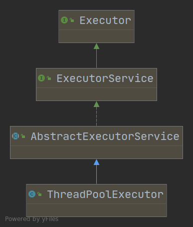
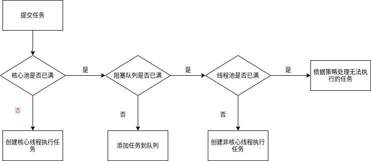

# java线程池

java.uitl.concurrent.ThreadPoolExecutor类是线程池中最核心的一个类



```java
public class ThreadPoolExecutor extends AbstractExecutorService {
    //.....
    public ThreadPoolExecutor(int corePoolSize,int maximumPoolSize,long keepAliveTime,TimeUnit unit,
            BlockingQueue<Runnable> workQueue);
 
    public ThreadPoolExecutor(int corePoolSize,int maximumPoolSize,long keepAliveTime,TimeUnit unit,
            BlockingQueue<Runnable> workQueue,ThreadFactory threadFactory);
 
    public ThreadPoolExecutor(int corePoolSize,int maximumPoolSize,long keepAliveTime,TimeUnit unit,
            BlockingQueue<Runnable> workQueue,RejectedExecutionHandler handler);
 
    public ThreadPoolExecutor(int corePoolSize,int maximumPoolSize,long keepAliveTime,TimeUnit unit,
        BlockingQueue<Runnable> workQueue,ThreadFactory threadFactory,RejectedExecutionHandler handler);
    //...
}
```

其中参数意义如下：

- corePoolSize： 线程核心池大小

- maximumPoolSize:  线程池最大线程数大小

- keepAliveTime: 线程池中非核心线程空闲的存活时间大小

- unit 线程空闲存活时间单位,有7种取值

  >TimeUnit.DAYS;                           //天
  >TimeUnit.HOURS;                       //小时
  >TimeUnit.MINUTES;                    //分钟
  >TimeUnit.SECONDS;                   //秒
  >TimeUnit.MILLISECONDS;         //毫秒
  >TimeUnit.MICROSECONDS;       //微妙
  >TimeUnit.NANOSECONDS;        //纳秒

- workQueue: 存放任务的阻塞队列

  > ArrayBlockingQueue：基于数组的先进先出队列，创建时必须指定大小；
  > LinkedBlockingQueue：基于链表的先进先出队列，如果创建时没有指定大小，默认为Integer.MAX_VALUE；
  > SynchronousQueue：不会保存提交的任务，而是将直接新建一个线程来执行新来的任务。

- threadFactory: 用于设置创建线程的工厂，可以给创建的线程设置有意义的名字，可方便排查问题。

- handler: 线城池的饱和策略事件，主要为四种策略

  > 1. AbortPolicy: 抛出一个异常，默认策略
  > 2. DiscardPolicy：直接丢弃任务
  > 3. DiscardOldestPolicy： 丢弃队列中最老的(即队列最前面)任务，尝试执行当前任务(重复此过程)
  > 4. CallerRunsPolicy： 交给线程池调用所在的线程进行处理

### 线程池状态

ThreadPoolExecutor中定义了一个volatile变量，另外定义了几个static final变量表示线程池的各个状态。线程池的状态分成了如下四种：

- **RUNNING**: 线程池初始化后处于RUNNING状态。
- **SHUTDOWN**: 线程池调用shutdown()后线程池将会处于SHUTDOWN状态，该状态下线程池不再接收新的任务，会等待线程池中的所有任务执行完毕。
- **STOP**: 线程池调用shutdownNow()方法后线程池会处于STOP状态，该状态下线程池不再接收新的任务，同时会尝试终止正在执行的任务。
- **TERMINATED**: 线程池处于SHUTDOWN或STOP后且所有工作线程已经被销毁，任务队列已经完成或清空后线程池变为TERMINATED状态


### 任务执行

向线程池提交任务之后的流程如下：



在创建了线程池之后，默认情况下线程池中并没有任何线程，在任务到来时才创建线程去执行任务，或者创建后调用``prestartAllCoreThreads()``[创建所有核心池线程]或者``prestartCoreThread()``[创建一个核心池线程]方法创建线程。

Executors类中提供了创建特定线程池的静态方法，方便创建出特定的线程池：

- newCachedThreadPool() 

  创建一个corePoolSize为0，maximumPoolSize为Integer.MAX_VALUE，使用SynchronousQueue任务队列，非核心线程存活时间为60s的线程池。

  ```java
  public static ExecutorService newCachedThreadPool() {
      return new ThreadPoolExecutor(0, Integer.MAX_VALUE,
                                    60L, TimeUnit.SECONDS,
                                    new SynchronousQueue<Runnable>());
  }
  ```

- newSingleThreadExecutor(): 一直有一个线程且只有一个线程存活的队列

  ```java
  public static ExecutorService newSingleThreadExecutor() {
      return new FinalizableDelegatedExecutorService
          (new ThreadPoolExecutor(1, 1,
                                  0L, TimeUnit.MILLISECONDS,
                                  new LinkedBlockingQueue<Runnable>()));
  }
  ```

- newFixedThreadPool(int nThreads):创建指定线程数的线程池，线程一直存活

  ```java
  public static ExecutorService newFixedThreadPool(int nThreads) {
      return new ThreadPoolExecutor(nThreads, nThreads,
                                    0L, TimeUnit.MILLISECONDS,
                                    new LinkedBlockingQueue<Runnable>());
  }
  ```


在很多通用的情况下可以直接使用这些工具方法，节约参数配置时间的同时可以达到最优性能。

