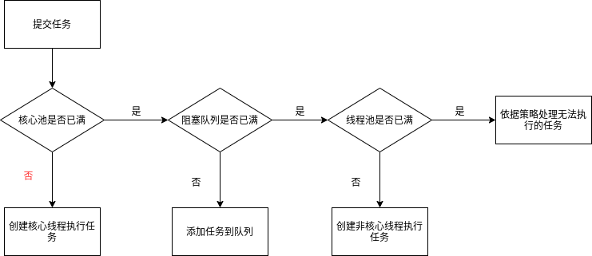

# java线程池

线程池组成部分

- 线程池管理器
- 工作线程
- 任务队列
- 任务接口

java.uitl.concurrent.ThreadPoolExecutor类是线程池中最核心的一个类


```java
public class ThreadPoolExecutor extends AbstractExecutorService {
    //.....
    public ThreadPoolExecutor(int corePoolSize,int maximumPoolSize,long keepAliveTime,TimeUnit unit,
            BlockingQueue<Runnable> workQueue);
 
    public ThreadPoolExecutor(int corePoolSize,int maximumPoolSize,long keepAliveTime,TimeUnit unit,
            BlockingQueue<Runnable> workQueue,ThreadFactory threadFactory);
 
    public ThreadPoolExecutor(int corePoolSize,int maximumPoolSize,long keepAliveTime,TimeUnit unit,
            BlockingQueue<Runnable> workQueue,RejectedExecutionHandler handler);
 
    public ThreadPoolExecutor(int corePoolSize,int maximumPoolSize,long keepAliveTime,TimeUnit unit,
        BlockingQueue<Runnable> workQueue,ThreadFactory threadFactory,RejectedExecutionHandler handler);
    //...
}
```

其中参数意义如下：

- **`corePoolSize`**： 线程核心池大小

- **`maximumPoolSize`**:  线程池最大线程数大小

- **`keepAliveTime`**: 线程池中非核心线程空闲的存活时间大小

- **`unit`** 线程空闲存活时间单位,有7种取值

  >TimeUnit.DAYS;                           //天
  >TimeUnit.HOURS;                       //小时
  >TimeUnit.MINUTES;                    //分钟
  >TimeUnit.SECONDS;                   //秒
  >TimeUnit.MILLISECONDS;         //毫秒
  >TimeUnit.MICROSECONDS;       //微妙
  >TimeUnit.NANOSECONDS;        //纳秒

- workQueue: 存放任务的阻塞队列

  > ArrayBlockingQueue：基于数组的先进先出队列，创建时必须指定大小；
  > LinkedBlockingQueue：基于链表的先进先出队列，如果创建时没有指定大小，默认为Integer.MAX_VALUE；
  > SynchronousQueue：不会保存提交的任务，而是将直接新建一个线程来执行新来的任务。

- threadFactory: 用于设置创建线程的工厂，可以给创建的线程设置有意义的名字，可方便排查问题。

- handler: 线城池的饱和策略事件，主要为<font color="red">四种拒绝策略</font>

  > 1. AbortPolicy: 抛出一个异常，默认策略
  > 2. DiscardPolicy：直接丢弃任务
  > 3. DiscardOldestPolicy： 丢弃队列中最老的(即队列最前面)任务，尝试执行当前任务(重复此过程)
  > 4. CallerRunsPolicy： 交给线程池调用所在的线程进行处理

### 线程池状态

ThreadPoolExecutor中定义了一个volatile变量，另外定义了几个static final常量表示线程池的各个状态。线程池的状态分成了如下四种：

- **RUNNING**: 线程池初始化后处于RUNNING状态。
- **SHUTDOWN**: 线程池调用shutdown()后线程池将会处于SHUTDOWN状态，该状态下线程池不再接收新的任务，会等待线程池中的所有任务执行完毕。
- **STOP**: 线程池调用``shutdownNow()[线程收到interrupt信号，返回未执行任务队列]``方法后线程池会处于STOP状态，该状态下线程池不再接收新的任务，同时会尝试终止正在执行的任务。
- **TERMINATED**: 线程池处于SHUTDOWN或STOP后且所有工作线程已经被销毁，任务队列已经完成或清空后线程池变为TERMINATED状态


### 任务执行

向线程池提交任务之后的流程如下：



拒绝时机：

1. 当Excutor关闭时，提交新任务拒绝
2. 上图的流程走到最后时触发拒绝策略

在创建了线程池之后，默认情况下线程池中并没有任何线程，在任务到来时才创建线程去执行任务，或者创建后调用``prestartAllCoreThreads()``[创建所有核心池线程]或者``prestartCoreThread()``[创建一个核心池线程]方法创建线程。

Executors类中提供了创建特定线程池的静态方法，方便创建出特定的线程池：

- newCachedThreadPool() 

  创建一个corePoolSize为0，maximumPoolSize为Integer.MAX_VALUE，使用SynchronousQueue任务队列，非核心线程存活时间为60s的线程池。

  ```java
  public static ExecutorService newCachedThreadPool() {
      return new ThreadPoolExecutor(0, Integer.MAX_VALUE,
                                    60L, TimeUnit.SECONDS,
                                    new SynchronousQueue<Runnable>());
  }
  ```

- newSingleThreadExecutor(): 一直有一个线程且只有一个线程存活的队列

  ```java
  public static ExecutorService newSingleThreadExecutor() {
      return new FinalizableDelegatedExecutorService
          (new ThreadPoolExecutor(1, 1,
                                  0L, TimeUnit.MILLISECONDS,
                                  new LinkedBlockingQueue<Runnable>()));
  }
  ```

- newFixedThreadPool(int nThreads):创建指定线程数的线程池，线程一直存活

  ```java
  public static ExecutorService newFixedThreadPool(int nThreads) {
      return new ThreadPoolExecutor(nThreads, nThreads,
                                    0L, TimeUnit.MILLISECONDS,
                                    new LinkedBlockingQueue<Runnable>());
  }
  ```


在很多通用的情况下可以直接使用这些工具方法，节约参数配置时间的同时可以达到最优性能。


## 线程池hook

```java
package com.seven.study.study;

import java.util.concurrent.*;
import java.util.concurrent.locks.Condition;
import java.util.concurrent.locks.ReentrantLock;

/**
 * 线程钩子实现
 * @author: Blank
 * @description: com.seven.study.study
 * @date: 5/16/20
 * @version: 1.0
 */
public class PausedThreadPool extends ThreadPoolExecutor {
    private boolean isPaused;
    private ReentrantLock lock = new ReentrantLock();
    private Condition unpaused = lock.newCondition();


    public PausedThreadPool(int corePoolSize, int maximumPoolSize, long keepAliveTime, TimeUnit unit, BlockingQueue<Runnable> workQueue) {
        super(corePoolSize, maximumPoolSize, keepAliveTime, unit, workQueue);
    }

    public PausedThreadPool(int corePoolSize, int maximumPoolSize, long keepAliveTime, TimeUnit unit, BlockingQueue<Runnable> workQueue, ThreadFactory threadFactory) {
        super(corePoolSize, maximumPoolSize, keepAliveTime, unit, workQueue, threadFactory);
    }

    public PausedThreadPool(int corePoolSize, int maximumPoolSize, long keepAliveTime, TimeUnit unit, BlockingQueue<Runnable> workQueue, RejectedExecutionHandler handler) {
        super(corePoolSize, maximumPoolSize, keepAliveTime, unit, workQueue, handler);
    }

    public PausedThreadPool(int corePoolSize, int maximumPoolSize, long keepAliveTime, TimeUnit unit, BlockingQueue<Runnable> workQueue, ThreadFactory threadFactory, RejectedExecutionHandler handler) {
        super(corePoolSize, maximumPoolSize, keepAliveTime, unit, workQueue, threadFactory, handler);
    }

    @Override
    protected void beforeExecute(Thread t, Runnable r) {
        super.beforeExecute(t, r);
        lock.lock();
        try {
            // 暂停函数
            while (isPaused) {
                unpaused.await();
            }
        } catch (InterruptedException e) {
            e.printStackTrace();
        } finally {
            lock.unlock();
        }
    }

    /**
     * 暂停线程池执行
     */
    public void pause() {
        lock.lock();
        try {
            isPaused = true;
        } finally {
            lock.unlock();
        }
    }

    /**
     * 回复线程池执行
     */
    public void resume () {
        lock.lock();
        try {
            isPaused = false;
            unpaused.signalAll();
        } finally {
            lock.unlock();
        }
    }

    public static void main(String[] args) throws InterruptedException {
        PausedThreadPool pausedThreadPool = new PausedThreadPool(10, 20, 10L, TimeUnit.SECONDS, new LinkedBlockingDeque<>());
        Runnable runnable = () -> {
            System.out.println("thread execute");
            try {
                Thread.sleep(10);
            } catch (InterruptedException e) {
                e.printStackTrace();
            }
        };
        for (int i = 0; i <100000; i++) {
            pausedThreadPool.execute(runnable);
        }
        Thread.sleep(1500);
        pausedThreadPool.pause();
        System.out.println("thread pool paused");
        Thread.sleep(1500);
        pausedThreadPool.resume();
        System.out.println("thread pool resumed");
    }
}
```

## 线程池线程复用

用相同的线程去执行不同的任务，在runWorker方法中死循环查看任务队列中是否有任务，如果有就提取第一个任务调用任务的run方法执行任务