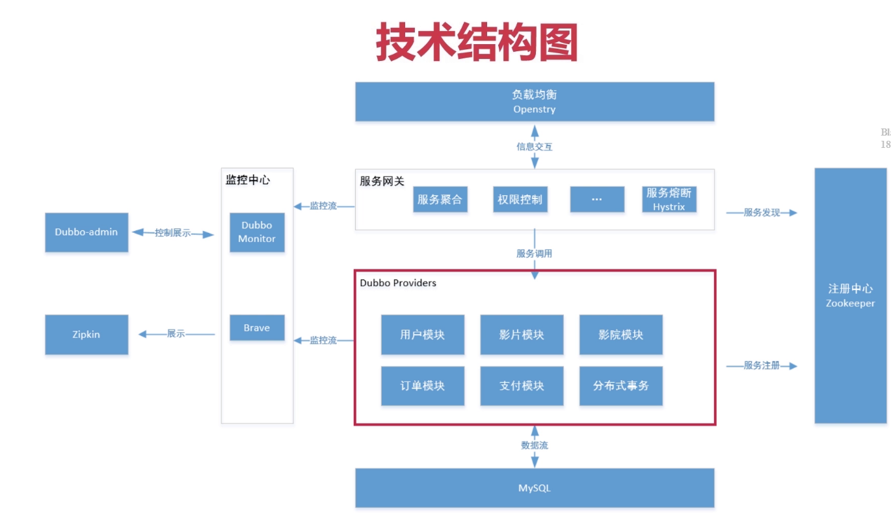

# 搭建dubbo环境




- provider: 服务提供者,提供服务实现

- consumer: 服务调用者,调用provider提供的服务实现

  > 同一个服务既可以时provider,又是consumer 

- Registory 服务注册与发现的注册中心,通常使用Zookeeper

- Monitor 统计服务的调用次数与调用时间的监控中心

- Container 服务运行容器


## 构建dubbo业务平台

1. 创建一个maven项目(不使用maven archetype)为父工程

   ```xml
   <parent>
       <groupId>org.springframework.boot</groupId>
       <artifactId>spring-boot-starter-parent</artifactId>
       <version>2.3.1.RELEASE</version>
       <relativePath/> <!-- lookup parent from repository -->
   </parent>
   
   <groupId>com.seven.dubbo.shop</groupId>
   <artifactId>dubbo-shop</artifactId>
   <version>1.0-SNAPSHOT</version>
   <name>dubbo-shop</name>
   <packaging>pom</packaging>
   
   <modules>
       <module>shop-gateway</module>
       <module>shop-api</module>
       <module>shop-common</module>
       <module>shop-coupon</module>
       <module>shop-goods</module>
       <module>shop-order</module>
       <module>shop-pay</module>
       <module>shop-user</module>
   </modules>
   ```

   

2. 构建如下module
   - 服务网关shop-gateway<font color="red">(springboot)</font>
   - 接口层：shop-api<font color="red">(jar)</font>
   - 优惠券服务：shop-coupon-service<font color="red">(springboot)</font>
   - 订单服务：shop-order-service<font color="red">(springboot)</font>
   - 支付服务：shop-pay-service<font color="red">(springboot)</font>
   - 商品服务：shop-goods-service<font color="red">(springboot)</font>
   - 用户服务：shop-user-service<font color="red">(springboot)</font>
   - 公共服务：shop-common<font color="red">(jar)</font>

3. 引入dubbo

   ```xml
   <dependency>
       <groupId>org.apache.dubbo</groupId>
       <artifactId>dubbo-spring-boot-starter</artifactId>
       <version>2.7.7</version>
   </dependency>
   ```

4. 引入zookeeper客户端

   ```xml
   <dependency>
       <groupId>com.101tec</groupId>
       <artifactId>zkclient</artifactId>
       <version>0.11</version>
       <exclusions>
           <exclusion>
               <groupId>log4j</groupId>
               <artifactId>log4j</artifactId>
           </exclusion>
           <exclusion>
               <groupId>org.slf4j</groupId>
               <artifactId>slf4j-log4j12</artifactId>
           </exclusion>
       </exclusions>
   </dependency>
   ```

5. 配置

   ```properties
   spring.application.name=shop-gateway
   spring.dubbo.server=true
   spring.dubbo.registry=zookeeper://127.0.0.1:2181
   ```

6. 在main方法所在的类上添加`@EnableDubboConfig`的注解


2020-07-02 21:09:02.861 ERROR 27675 --- [nio-8081-exec-4] o.a.c.c.C.[.[.[.[dispatcherServlet]      : Servlet.service() for servlet [dispatcherServlet] in context with path [/api] threw exception [Request processing failed; nested exception is org.springframework.core.annotation.AnnotationConfigurationException: Different @AliasFor mirror values for annotation [org.springframework.web.bind.annotation.RequestParam] declared on public java.lang.String com.seven.dubbo.shop.gateway.controllers.SampleController.hello(java.lang.String); attribute 'name' and its alias 'value' are declared with values of [name] and [name not get].] with root cause