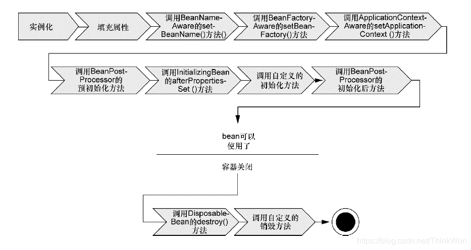

# IOC

## DI(Dependency Injection)

DI means giving an object its instance variables (the objects that are used into that object) rather than created by the Object itself.

- Constructor Injection
- Setter Injection

## IoC(Inversion of Control)

Inversion of Control is a programming design principle that inverts the flow of control to achieve the following design purposes:

-  To decouple the execution of a task from implementation.
- To focus a module on the task it is designed for.
- To free modules from assumptions about how other systems do what they do and instead rely on contract
- To prevent side effect when replacing a module

## Container Ioc

The container Ioc is a tool inside some frameworks that has the control to create and inject instance of object that your application depends on, means instead of you are creating an object using the new operator, let the container do that for you.

## Spring IOC 生命周期

1. 启动
2. 运行
3. 停止

BeanFactory与FactoryBean

BeanFactory是IOC底层容器

FactoryBean是创建Bean的一种方式，帮助实现复杂的初始化逻辑

Spring IOC容器启动时做的准备：

IOC配置元信息的读取和解析，IOC容器生命周期，Spring事件发布国际化等

- BeanDefinition 元信息

  | 属性(Property)           | 说明                                         |
  | ------------------------ | -------------------------------------------- |
  | Class                    | Bean全类名，必须是具体类，不能用抽象类或接口 |
  | Name                     | Bean的名称或ID                               |
  | Scope                    | Bean的作用域(singleton、prototype等)         |
  | Constructor arguments    | Bean构造器参数(用于依赖注入)                 |
  | Properties               | Bean属性设置(用于依赖注入)                   |
  | Autowiring mode          | Bean自动绑定模式                             |
  | Lazy initialization mode | Bean延迟初始化模式                           |
  | Initialization method    | Bean初始化回调方法名称                       |
  | Destruction method       | Bean销毁回调方法名称                         |

### spring bean

### Spring框架支持以下五种bean的作用域：

1. singleton: bean在每个spring ioc容器中只有一个实例, 缺省默认作用域为Singleton。
2. prototype: 一个bean的定义可以有多个实例
3. request: 每次http请求都会创建一个bean，该作用域仅在基于web的spring applicationContext下有效
4. session: 在一个HTTP Session中，一个bean定义对应一个实例，同样在web下才有效
5. global-session: 在一个全局的HTTP Session中，一个bean定义对应一个实例,同样在web下才有效

### Spring bean生命周期

bean在Spring容器中从创建到销毁经历了若干阶段，每一阶段都可以针对Spring如何管理bean进行个性化定制。

1. Spring 对bean进行实例化
2. Spring 将值和bean的引用注入到bean对应的属性中
3. 如果bean实现了BeanNameAeare接口，Spring将bean的ID传递给SetBeanName方法
4. 如果bean实现了BeanFactoryAware接口，Spring将调用setBeanFactory方法，将BeanFactory容器实例传入
5. 如果bean实现了ApplicationContextAware接口，Spring将调用setApplicationContext方法，将bean所在的应用上下文的引入传入进来
6. 如果bean实现了BeanPostProcessor接口，Spring将调用postProcessBeforeInitialization方法
7. 如果bean实现了InitializingBean接口，Spring将调用他的afterPropertiesSet方法，类似的如果bean使用initmethod声明了初始化方法，该方法也将被调用
8. 如果bean实现了BeanPostProcessor接口，Spring将调用他的postProcessAfterInitialization方法，此时，bean的初始化就算完成，将一直驻留在应用上下文中，直到应用被销毁
9. 如果bean实现了DisposableBean接口，Spring将调用他的destroy方法，同样，如果bean声明了destroy-method将会调用该销毁方法

**spring bean的自动装配方式**

1. no: 默认的方式是不进行自动装配，通过手工设置ref属性来进行装配bean
2. byName: 通过bean的名称进行自动装配，如果一个bean的property与另一个bean的name相同，就进行自动装配。
3. byType: 通过参数的数据类型进行自动装配
4. constructor: 利用构造函数进行装配，并且构造函数的参数通过byType进行装配
5. autodetect: 自动探测，如果有构造方法，通过construct的方式进行装配，否则使用byType的方式进行自动装配

