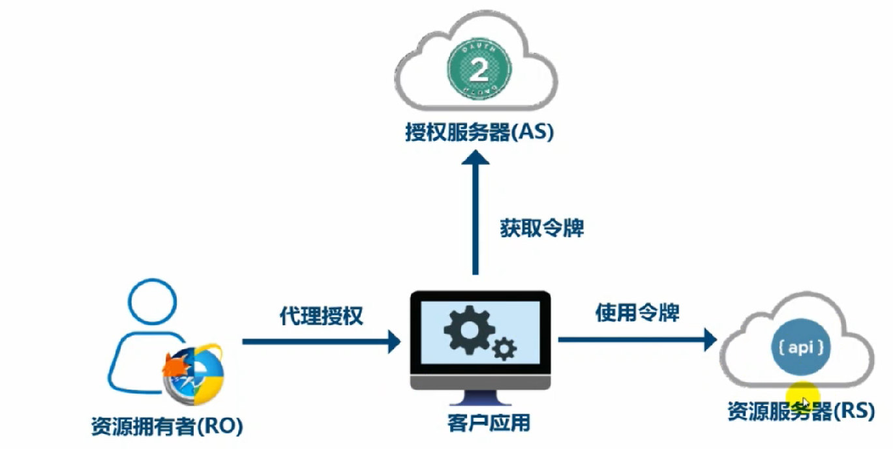

# OAuth2.0

用于REST/APIs代理授权框架




Oauth 相关

Client Application(客户端应用)

Resource Server(资源服务器)

Authorized Server(授权服务器)

Resource Owner(资源拥有者) 资源拥有人，想要分享某些资源给第三方应用

Client Credentials(客户凭证)

Tokens(令牌) 授权服务器接收到客户端请求后颁发令牌

Scopes(作用域)权限细分

OAuth令牌类型

Access Token(访问令牌) 代表一个用户或服务器直接去访问受保护的资源

Refresh Token(刷新令牌) 用于区授权服务器获取一个新的访问令牌

Authorization Code Token(授权码)　仅用于授权码授权类型，拥有交换获取访问令牌和刷新令牌

Bearer Token 可以直接访问资源

Proof of Possession Token 校验client是否对Token有明确的拥有权


Oauth2.0并没有支持HTTP以外的协议

Oauth2.0并没有并不是一个认证协议，仅用于授权代理

Oauth2.0并没有授权处理机制，没有定义token格式，没有定义加密方法

## OAuth flow

### Authorization Code Token

https://tools.ietf.org/html/rfc6749

```
     +----------+
     | Resource |
     |   Owner  |
     |          |
     +----------+
          ^
          |
         (B)
     +----|-----+          Client Identifier      +---------------+
     |         -+----(A)-- & Redirection URI ---->|               |
     |  User-   |                                 | Authorization |
     |  Agent  -+----(B)-- User authenticates --->|     Server    |
     |          |                                 |               |
     |         -+----(C)-- Authorization Code ---<|               |
     +-|----|---+                                 +---------------+
       |    |                                         ^      v
      (A)  (C)                                        |      |
       |    |                                         |      |
       ^    v                                         |      |
     +---------+                                      |      |
     |         |>---(D)-- Authorization Code ---------'      |
     |  Client |          & Redirection URI                  |
     |         |                                             |
     |         |<---(E)----- Access Token -------------------'
     +---------+       (w/ Optional Refresh Token)
```

资源拥有者，通过user-agent client区访问资源

user-agent重定向到Authorization-server,携带用户标识和验证完成后要重定向到的目标地址

Authorization-Server要求用户进行验证

如果用户验证成功，返回Authorization Code到user-agent

user-agent将Authorization Code给Client

客户端将Authorization Code发送回Authorization-Server同时携带完成后的重定向URI

授权服务器校验Authorization Code，成功后将Access-Token/RefreshToken发送通过重定向给客户端

Client现在可以以Resource-Owner访问资源

### 简化模式

```
     +----------+
     | Resource |
     |  Owner   |
     |          |
     +----------+
          ^
          |
         (B)
     +----|-----+          Client Identifier     +---------------+
     |         -+----(A)-- & Redirection URI --->|               |
     |  User-   |                                | Authorization |
     |  Agent  -|----(B)-- User authenticates -->|     Server    |
     |          |                                |               |
     |          |<---(C)--- Redirection URI ----<|               |
     |          |          with Access Token     +---------------+
     |          |            in Fragment
     |          |                                +---------------+
     |          |----(D)--- Redirection URI ---->|   Web-Hosted  |
     |          |          without Fragment      |     Client    |
     |          |                                |    Resource   |
     |     (F)  |<---(E)------- Script ---------<|               |
     |          |                                +---------------+
     +-|--------+
       |    |
      (A)  (G) Access Token
       |    |
       ^    v
     +---------+
     |         |
     |  Client |
     |         |
     +---------+
```

### 密码模式

```
　　　+----------+
     | Resource |
     |  Owner   |
     |          |
     +----------+
          v
          |    Resource Owner
         (A) Password Credentials
          |
          v
     +---------+                                  +---------------+
     |         |>--(B)---- Resource Owner ------->|               |
     |         |         Password Credentials     | Authorization |
     | Client  |                                  |     Server    |
     |         |<--(C)---- Access Token ---------<|               |
     |         |    (w/ Optional Refresh Token)   |               |
     +---------+                                  +---------------+
```

### client credentials

```
The client credentials grant type MUST only be used by confidential
   clients.

     +---------+                                  +---------------+
     |         |                                  |               |
     |         |>--(A)- Client Authentication --->| Authorization |
     | Client  |                                  |     Server    |
     |         |<--(B)---- Access Token ---------<|               |
     |         |                                  |               |
     +---------+                                  +---------------+

                     Figure 6: Client Credentials Flow
```

### 刷新令牌

```
  +--------+                                           +---------------+
  |        |--(A)------- Authorization Grant --------->|               |
  |        |                                           |               |
  |        |<-(B)----------- Access Token -------------|               |
  |        |               & Refresh Token             |               |
  |        |                                           |               |
  |        |                            +----------+   |               |
  |        |--(C)---- Access Token ---->|          |   |               |
  |        |                            |          |   |               |
  |        |<-(D)- Protected Resource --| Resource |   | Authorization |
  | Client |                            |  Server  |   |     Server    |
  |        |--(E)---- Access Token ---->|          |   |               |
  |        |                            |          |   |               |
  |        |<-(F)- Invalid Token Error -|          |   |               |
  |        |                            +----------+   |               |
  |        |                                           |               |
  |        |--(G)----------- Refresh Token ----------->|               |
  |        |                                           |               |
  |        |<-(H)----------- Access Token -------------|               |
  +--------+           & Optional Refresh Token        +---------------+

               Figure 2: Refreshing an Expired Access Token
```