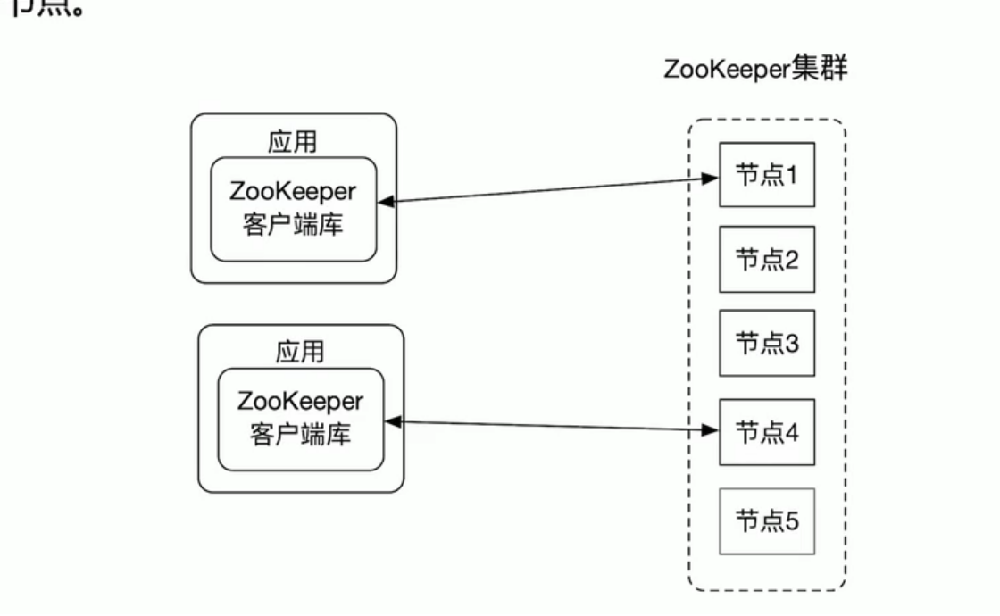

# zookeeper

开源的分布式协同服务

典型应用场景

- 配置管理(configuration management)
- DNS服务
- 组成员管理
- 各种分布式锁

zookeeper适用于关键数据存储而不适合于大量数据的存储 

zookeeper的节点znode分类:

1. 持久性的znode(PERSISTENT): znode在创建之后即使发生zookeeper集群宕机或者client宕机也不会丢失

2. 临时性的znodez(EPHEMERAL): client宕机或者client在指定的timeout时间内没有给zookeeper集群发消息，这样的znode就会消失

   znode可以是顺序性的，每一个顺序性的znode关联一个唯一的单调递增整数，是znode名字的后缀

3. 持久顺序行的znode(PERSISTENT_SEQUENTIAL)： znode除了具备持久性znode的特点之外，znode的名字具备顺序性

4. 临时顺序性的znode(EPHEMERAL_SEQUENTIAL): znode除了具备临时性znode的特点之外，znode的名字具备顺序性

zookeeper总体架构

应用使用zookeeper客户端库来使用zookeeper服务，zookeeper集群可以有两种模式

- standalone: 单节点

- quorum：多个节点

  一个集群中只有一个leader节点，其他为follower节点。leader节点可以处理读写请求，follower节点只可以处理读请求，follower节点在接收到写请求时会把写请求转发给leader来处理。

  数据一致性: 

  - 全局可线性化(Linearizable)写入:先到达leader的写请求会先处理，leader决定写请求的执行顺序
  - 客户端FIFO顺序: 来自客户端的请求按照发送顺序执行



session

zookeeper客户端和zookeeper集群中的某个节点在连接时创建一个session，客户端可以主动关闭session，如果zookeeper节点没有在session关联的timeout时间内收到客户端的消息会关闭session，zookeeper客户端如果发现连接的zookeeper出错，会自动和其他zookeeper节点建立连接session

重要配置项：

- clientPort: zookeeper对客户端提供服务的端口
- dataDir: 指定快照文件保存目录，如果没有十二只dataLogDir，事务日志文件也会保存到这个目录
- dataLogDir: 用来保存事务日志文件的目录。zookeeper在提交一个事务之前，需要保证事务日志记录的落盘，所以需要为dataLogDir分配一个独占的存储设备


# zookeper集群的搭建

[下载zookeeper](https://zookeeper.apache.org/)

配置文件

我们开启三个服务器节点，一个leader，两个flower，对应三个配置文件和三个数据存放目录已经三个监听节点,修改如下配置信息

node1

```bash
# node-1.cfg
clientPort=2181
dataDir=./zookeeper-cluster/node-1/data

server.1=127.0.0.1:2881:3881
server.2=127.0.0.1:2882:3882
server.3=127.0.0.1:2883:3883
```

node2

```bash
# node-1.cfg
clientPort=2182
dataDir=./zookeeper-cluster/node-2/data

server.1=127.0.0.1:2881:3881
server.2=127.0.0.1:2882:3882
server.3=127.0.0.1:2883:3883
```

node3

```bash
# node-1.cfg
clientPort=2182
dataDir=./zookeeper-cluster/node-2/data

server.1=127.0.0.1:2881:3881
server.2=127.0.0.1:2882:3882
server.3=127.0.0.1:2883:3883
```

解释：server.服务器 ID=服务器 IP 地址：服务器之间通信端口：服务器之间投票选举端口

在每个 zookeeper 的 data 目录下创建一个 myid 文件，内容分别是 1、2、3 。这个文件就是记录每个服务器的 ID

```bash
mkdir -p zookeeper-cluster/node-1/data
mkdir -p zookeeper-cluster/node-2/data
mkdir -p zookeeper-cluster/node-3/data

echo 1 > zookeeper-cluster/node-1/data/myid
echo 2 > zookeeper-cluster/node-2/data/myid
echo 3 > zookeeper-cluster/node-3/data/myid
```

启动zookeeper

```bash
bin/zkServer.sh start zookeeper-cluster/node-1/zoo.cfg
bin/zkServer.sh start zookeeper-cluster/node-2/zoo.cfg
bin/zkServer.sh start zookeeper-cluster/node-3/zoo.cfg
```

